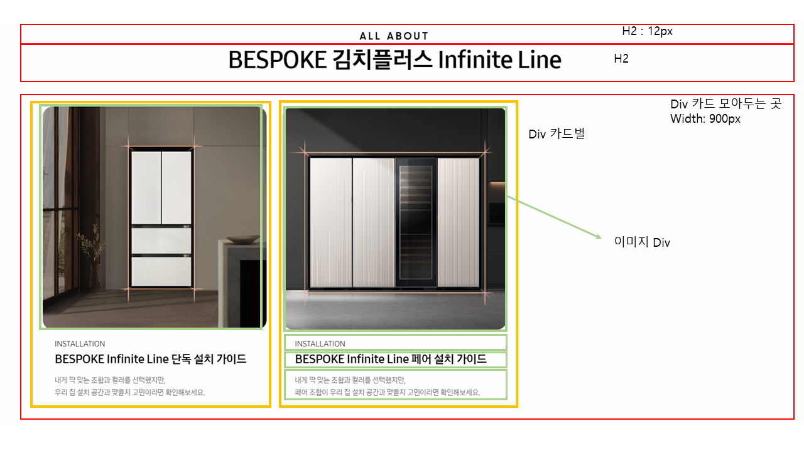
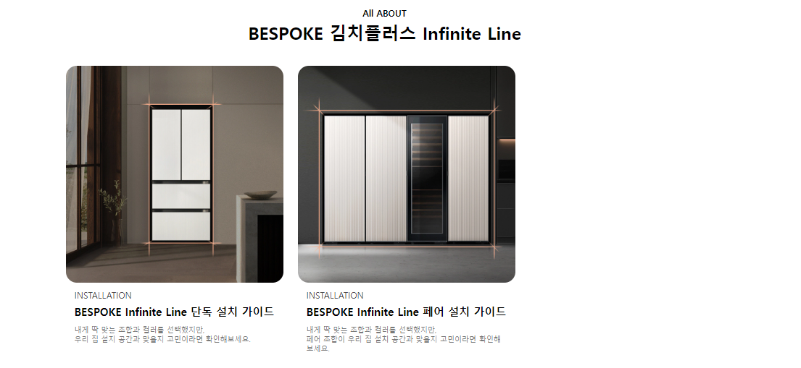
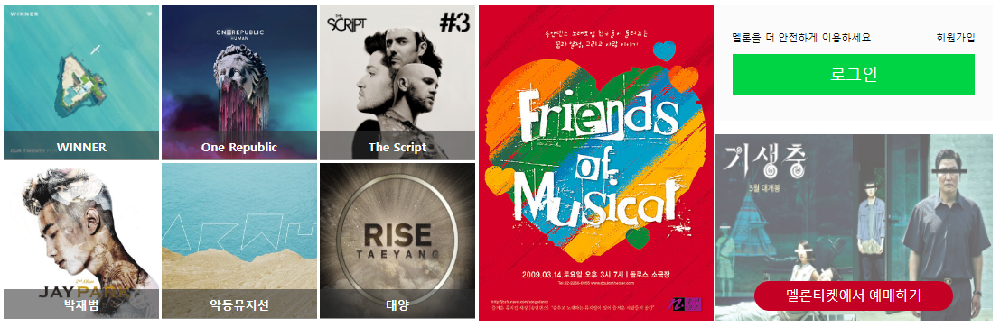
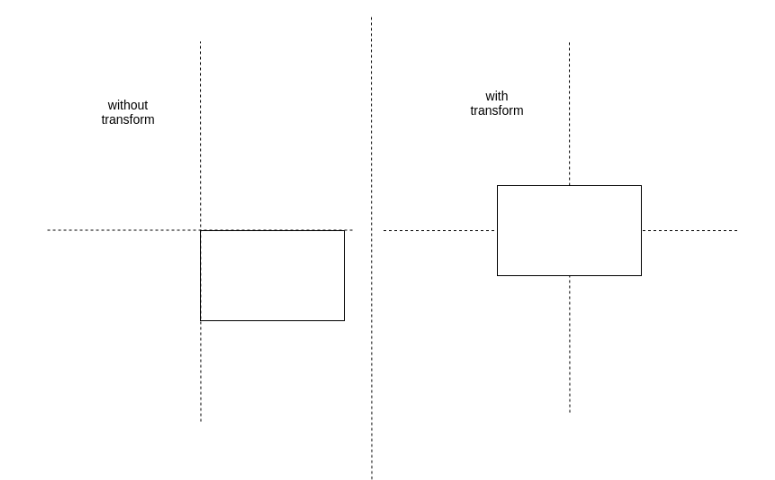

# 🧑‍💻20220830 HTML, CSS 실습 정리 

[실습 1](#실습-1)

🚨🚨🚨[실습 2](#실습-2)🚨🚨🚨


## 실습 1


> 위에 보이는 사이트 일부분을 만드는 것
>
> font는 기본 폰트로 사용

[실습 Detail](./실습1/README.md)

#### 실습 레이아웃




### 실습 결과물



- 진행을 하면서 레이아웃과 조금씩 달라지긴 했다

#### 사용 코드

- HTML에서는 모든 태그들을 `class`로 묶어줬다
- 어제랑 달라진 점은, 컨테이너에 `display: flex`를 주었다

```html
<div class="cards">
    <div class="card">
      
      <p class="installation">INSTALLATION</p>
      <p class="guide">BESPOKE Infinite Line 단독 설치 가이드</p>
      <p class="detail">내게 딱 맞는 조합과 컬러를 선택했지만,<br>우리 집 설지 공간과 맞을지 고민이라면 확인해보세요.</p>
    </div>
```

```css
.category{
    font-size: 12px;
}

.cards{
    display: flex;
    width: 900px;
    margin: 0 auto;
}

.card{
    width: 300px;
    margin: 10px;
}

img{
    width: 100%;
    border-radius: 15px;
}

p{
    padding: 0px 12px;
    font-size: 15px;
    margin: 5px 0;
}

.installation{
    font-size: 12px;
    color: rgb(73, 73, 73);
}

.guide{
    font-weight: bold;
}

.detail{
    margin-top: 8px;
    font-size: 10px;
    color: rgb(122, 122, 122);
```

- 확실히 어제와 다르게, `display: flex`를 쓰니, 바로 양 옆으로 카드들이 정렬이 되었다
  - 그리고 어제 제일 큰 문제였던, 상단을 맞추는 것도, flex를 쓰다보니 자동으로 상단으로 정렬이 되었다

## 실습 2

> 실습 2는 최대한 오늘 배운 `display: flex`와 `position`을 사용했다
>
> 멜론 홈페이지에 있는 최신 엘벌 쪽에 있는 그리드를 클론했다

[코드](./실습2)

### 레이아웃


- 설계는 main container 한 개, 그리고 그 안에 3개의 item들을 넣었다
  - 그리고 3개의 item들을 `justify-content: space-evenly`로 정렬을 했다
- 1번 item과 3번 item들도 container로 만들었다
  - 각 container들 안에도 item들을 넣었다
- **특이점**
  - 1번과 3번 item들은 `position`도 사용했다
  - 1번 item들 같은 경우 이미지 위로, 하단에 가수 이름들이 적혀있다
  - 3번 item들 같은 경우, 이미지 위에 버튼을 만들어야 했다


### 결과물



- 결과물은 나름 만족했지만, 중간중간 갭이 너무 좁아서 조금 아쉽긴했다

- 제일 어려웠던 것은 '멜론티켓에서 예매하기' 버튼의 좌우를 중앙으로 맞추는 것이었다.
  - 먼저 `left` 값에 50%를 주었다
  - 그리고 `transform: translate(-50%,0)`을 통해 좌우 중앙을 맞췄다

```css
.purchase{
    position: absolute;
    left: 50%;
    bottom: 10px;
    transform: translate(-50%, 0);
    width: 200px;
    height: 30px;
    border: 0px;
    border-radius: 20px;
    background-color: rgb(197, 0, 37);
    color: white;
}
```

여기서 `transform: translate(-50%,0)`이란???

- `transform: translate(x, y)` 이다
  - x축 혹은 y축으로 x만큼, 또는 y만큰 추가적으로 이동하는 것
  - 예를 들어 위 코드에서 왼쪽으로 50%를 갔다가, `left: 50%`
  - 오른쪽으로 `-50%`를 `transform: translate(-50%, 0)` 통해 갔다

**밑에는 `top: 50%;` / `left: 50%`** 를 먼저 움직이고

`transform: translate(-50%, -50%)` 통해 중앙으로 정렬을 했다 



