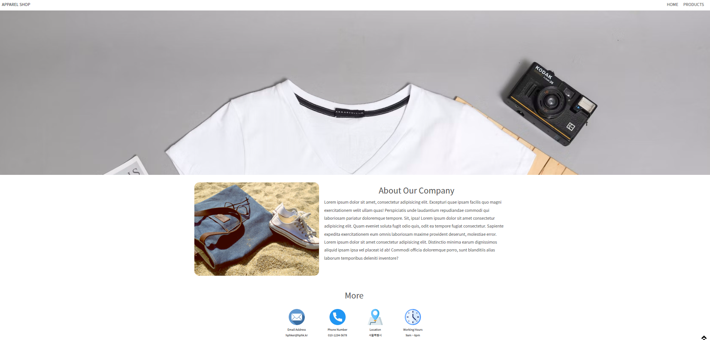
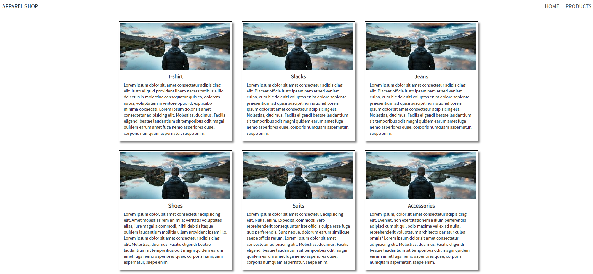

# 20220901 실습

> 간단한 홈페이지 만들기
>
> Home과 Product 페이지, 2개를 만드는 실습

[Home](#home)

[Product](#Product)

## Home

### Layout

> 제일 크게 navbar / banner/ contents 로 박스를 만들었다
>
> 웹페이지 넓이가 min-width 1280px로 지정이 되어있다

- 기본적으로 `display: flex;`를 자주 사용하였다
  - 특히 block 내에 자식 요소들을 `justify-content: center;`를 통해 중앙으로 정렬을 많이 했다
- Nav bar는 `flex`, `justify-content: space-between`을 통해 왼쪽 끝에, 로고를, 오른쪽 끝에 링크들을 넣어뒀다
  - 그리고 `position: sticky`를 통해 최상단에 계속 붙어있을 수 있게 했다
- `nav-link`, nav bar에 오른쪽에 있는 링크들에게 hover을 주었다
  - hover란? 마우스를 해당 링크에 갖다 댔을 때, 변화를 주는 것이다
  - 여기서 마우스를 가져다 대면, 천천히 더 어둡게 변화하는 것을 느낄 수 있다
  - `transition: all ease-out 0.5s;` 을 통해 어둡게 변화하는 시간을 조금 주면서, 애니메이션 같은 효과를 주었다
    - all 은 모든 것을 0.5초 동안 ease-out 검정색이 밖으로 퍼지는 효과
- `banner` 의 높이는 700px을 주었다. 그 배너 안에 이미지를 css에서 넣는 것이다
  - background-size는 `background-size: 100%, 700px;`으로 넓이를 100% 주고, 높이를 700px에 맞추는 것이다
    - 이렇게 해야 이미지가 banner 안으로 딱 맞게 고정이 된다
  - `background-repeat`은 기본적으로 `repeat`으로 되어있는데, 만약 이럴 경우, 배너에 똑같은 이미지가 여러게 보일 수 있다
    - 그래서 `no-repeat`으로 설정
- 그리고 `position: fixed` 사용해서 위로 가는 이미지를 오른쪽 하단에 배치를 했다

### 결과물

## Product

### Layout

- Product 페이지는 크게 할게 없었다
  - 일단 너비 기준 1280px인데, 한 열에 3개의 카드를 넣는 것이 었다.
  - 이미지가 딱 그 기준에 맞아, 이미지 기준으로 각 카드를 만들었다
  - 여기서 제일 중요시 한 것은 `flex`를 한 후 `flex-flow: row wrap;`을 했다는 점
    - `wrap`을 통해서 카드들이 너비 1280px 안으로 들어올 수 있도록 설정 했다
    - 그렇게 하더니 카드 3개 씩, 한 열에 들어왔다

### 결과물

