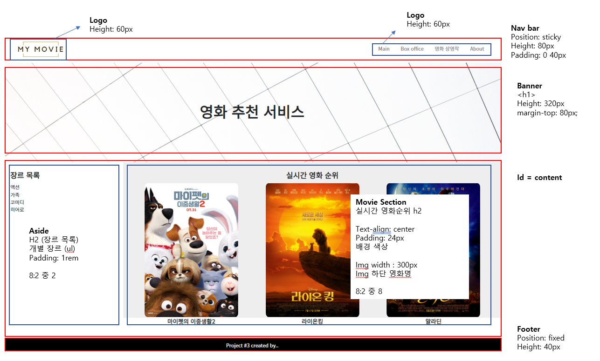

# 9월 2일 실습

### Pair Project

처음 혼자가 아닌 프로젝트를 했다. 3명에서 한 조를 만들어 진행을 했다.

서로서로 모르는 것들을 알려주면서 이번 주에 배운 내용을 복습 할 수 있어서 너무 좋았다.

특히 개발 시작하고 처음으로, 다른 분들이 나를 통해 많은 것을 배울 수 있었다는 말이 너무 좋았다!


### Layout



- 큰 block 위주로 먼저 설계하기
  - 제일 먼저 팀원들과 제일 큰 블럭들을 먼저 정리했다.
  - 여기서 Nav bar, banner, content, footer 들이 나왔다
- 그리고 웹사이트 정보들을 읽으면서 세부 요청 사항들도 정리를 해놓았다

> 확실히 설계를 먼저 해놓으니깐, html에서 태그들을 만들 때 많이 편했다. 어떤 태그를 부모 요소로, 그리고 어떤 태그를 자식 요소로 넣어야 할지 확실하게 잡혔다


[html 코드](./index.html)

[css 코드](./index.css)

- html과 css를 이미 독학을 한 경험이 있어, 나는 최대한 질문하는 식으로 팀원들이 프로젝트에 참여할 수 있도록 유도를 했다
- 팀원들도 많이 배워야 하니깐, 내가 다 하는 것이 아닌, 팀원들이 최대한 많은 것을 할 수 있도록 했다
- 그리고 내가 코드를 넣으면, 왜 그 코드를 넣었는지 최대한 자세하게 설명해 주었다.

> 확실히 독학할 때, 많이 햇깔렸던 부분들을, 이번 주 강의와 프로젝트를 통해 이해할 수 있었다. (특히 flex부분)
>
> 그리고 개발자 도구의 힘을 정말 많이 느꼈다


### 중요 코드

- Overlay 기능 즉 hover를 했을때, 배경색이 어둡게 나오고, 영화 이름이 나오는 부분을 다시 해보았다

```css
.movie-info{
    position: relative;
}

.overlay{
    position: absolute;
    z-index: 3;
    top: 50%;
    left: 50%;
    transform: translate(-50%, -50%);
    color: white;
    font-size: 1rem;
    font-weight: 700;
}

.overlay-background{
    position: absolute;
    border-radius: 10px;
    height: 429.81px;
    width: 100%;
    background-color: rgba(0, 0, 0, 0.5);
}

.overlay,
.overlay-background{
    visibility: hidden;
    opacity: 0;
    transition: visibility 0s, opacity 0.5s linear;
}

.movie-info:hover .overlay,
.movie-info:hover .overlay-background{
    visibility: visible;
    opacity: 1;
}
```

- `movie-info`는 각 영화 카드 섹션들이다
  - 제일 중요한 부분은 `overlay`와 `overlay-background` 부분에 `transition` 부분이다
    - `linear` : transition 효과를 처음부터 끝까지 일정하게 주는 것
    - `opacity 0.5s` : opacity 0 부터 1까지 0.5초 동안 일정하게 효과를 준다
- overlay는 총 2개가 있다
  - 배경 overlay와 글자 overlay