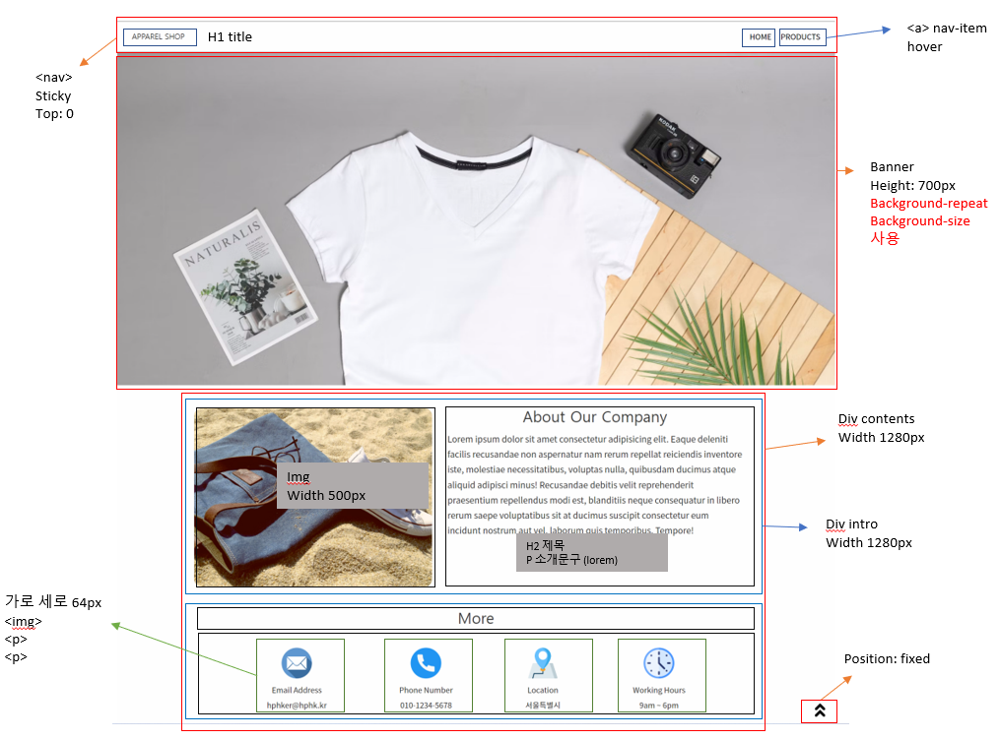
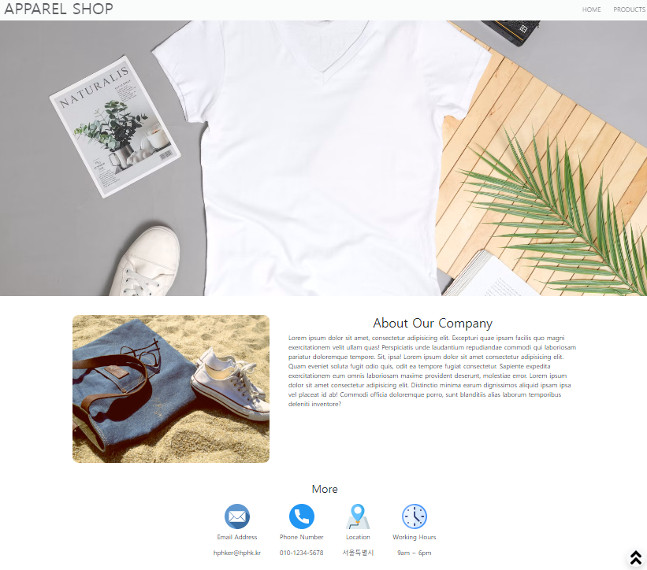

# 20220901 실습

> 간단한 홈페이지 만들기
>
> Home과 Product 페이지, 2개를 만드는 실습

[Home](#home)

[Product](#Product)

## Home

### Layout

> 제일 크게 navbar / banner/ contents 로 박스를 만들었다
>
> 웹페이지 넓이가 min-width 1280px로 지정이 되어있다

- 오늘은 Bootstrap을 이용하여 해당 페이지를 만들었다.
  - 확실히 Bootstrap을 이용하니 CSS를 사용하는 횟수가 많이 줄어들었고, CSS의 코드도 굉장히 많이 줄어들었다
  - 단, HTML class가 길어지고, 원래 똑같은 class라도, 각 class 안에 Bootstrap의 속성을 넣어서 작업을 하는데 조금 햇깔렸다

- 그 외에는 CSS를 정말 깔끔하게 볼 수 있어서 좋았다

### 결과물

## Product

### 결과물

