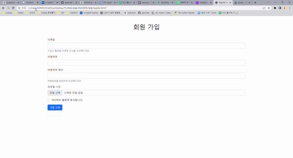

# Bootstrap 실습

### 실습 1.

> 회원 가입 페이지를 만듭니다.

**CSS 없이 Bootstrap만 가지고 만들었다**

[코드](./register.html)

[자바스크립트 코드](./register.js)

- **추가적인 기능**
  - 입력값이 아무것도 없을 시에 부트스트랩의 `need-validation` 클래스를 사용했다
    - 이것을 사용하게 되면 기본적으로 입력값이 없으면 오류 메세지를 뜨게 하는 기능이다
    - 하지만 자바스크립트 코드를 추가로 작성해야 해서, Bootstrap에서 제공해주는 코드를 넣어서 활용을 했다

### 실습 2. 

> 메인 페이지를 만듭니다.

[코드](homepage.html)

**Bootstrap을 이용해서, 오직 HTML로만 홈페이지를 만들었다**

- toggle 기능을 없앤 후, nav-right을 통해 `home, 제품, 광고`를 오른쪽에 배치를 했다
- 슬라이드, carousel 기능을 넣었고, width만 100%로 설정을 해놓았다

