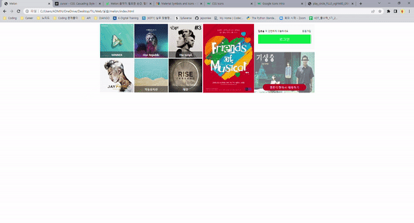

# Melon 클로닝 연습

[1차](#1차)

[2차](#2차)

## 1차

> 목표: 멜론에 있는 그리드 부분, `flex`를 이용해서, 뼈대만 만들어보기

- 여기서 제일 많이 쓰였던 것은 `display: flex` 이다

  - 먼저 전체적으로 `container`를 만들었다. 여기 안에는 3개의 block들을 넣었다

    1. 가수들 그리드 있는 block

    2. 포스터 block

    3. 로그인 block 으로 나누었다

  - 1번 그리드에는 6개의 카드가 있다 각 카드에는 position: relative이랑 absolute를 사용하여 하단에 가수 이름들을 이미지 위에 넣었다
  - 2번 그리드는 이미지만 넣어서 간단했다
  - 3번 그리드는 2개의 block으로 나뉘었다
    - 로그인은 `<button>` 태그로 로그인 창을 만들었다

### 느낀점

확실히 flex를 쓰니깐, 쉽게 부모의 자식 요소들을 배치할 수 있었다. 조금 시간이 오래 걸렸지만, 그래도 flex를 제대로 알 수 있는 시간이었다

## 2차

> Overlay 기능과 hover기능을 최대한 많이 사용했다.
>
> 사용자들이 마우스를 각 사진들 위에 놓았을때, 다양한 기능들을 볼 수 있도록 만들었다

- Overlay 기능은 가수들 엘범들에게 주었다
  - overlay는 html에 3개의 block으로 주었다
    - overlay-background : 배경이 어두워지게 만드는 것
    - overlay-name : 글씨가 나올 수 있게 만들어진 블럭
    - overlay-play : 플레이 버튼이 나올 수 있게 만들어진 블럭
  - css에서는 hover를 사용해서, 마우스를 해당 요소 위에 놓여지면, 효과가 바뀌는 효과를 만들었다

### 느낀점

확실히 계속 연속적으로 하면, 실력이 느는 것 같다. 특히 이제 계속 자신감이 붙어서, 멜론 전체 페이지를 클론할 계획을 가지고 있다. 특히 혼자 실습을 하면서, 모르는 것을 구글링 통해 발견하고, 새로운 것을 배울 수 있어 좋은 것 같다.