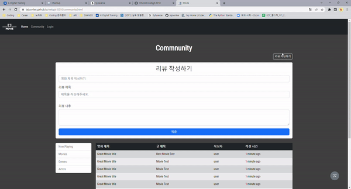

# 📋 Web Pair Project

🚨🚨  **[Code Link](https://github.com/jejoonlee/webpjt-0210)** 🚨🚨

**Category**

- [index](#index)
- [community](#community)
- [now playing](#now-playing)
- [movies](#movies)

## 후기

<u>9월 13일</u>

전체적으로 Bootstrap을 거의 모든 요소에 사용을 했다. 

두번째 그룹 프로젝트고, 처음으로 페어로 프로젝트를 했는데, 첫번째 그룹 프로젝트 때보다 더 몰입도가 있었다.

특히 상대방이 모르는 것이 있으면, 알려주면서 나 자신도 복습을 할 수 있었고, 같이 찾아보면서 많이 배울 수 있었다.

얘기를 하면서 프로젝트를 진행하니, 속도는 조금 느렸지만, 그래도 재미있게 할 수 있었다.

<u>9월 14일</u>

어제보다 더 과제가 자유로워진 덕분에 새로운 것을 더 많이 시도를 했다. 상대방도 새로운 것을 계속 시도를 하려고 했고, 덕분에 같이 찾으면서 많은 것을 배울 수 있었다.

처음 했던 그룹 프로젝트지만, Web 관련 배운 내용들을 웹을 만드며 복습하고, 새로운 것을 시도하며 새로운 것을 많이 배울 수 있었던 시간인 것 같다.

## index

- 로그인에 Modal을 이용한 것이 제일 새로웠다.
  - Modal 안에 로그인 정보를 넣는데, submit 버튼과 위에 로그인 정보를 연결하는데 집중을 했다.
    - 결국 submit 버튼을 로그인 정보 (Form) 태그 안에 넣어 문제를 해결했다
- 그 외에는 그전에 경험을 해서, 많이 익숙했던 부분들이었다

> my role : navigator
>
> 최대한 많이 알려주려고 했다. 대신 직접적으로 코드를 알려주는 것보단, 무엇을 어떻게 했으면 좋겠다라고 많이 얘기를 했었다.
>
> 특히 파트너분이 잘 하셔서, 큰 어려움은 없었다. 오히려 편하게, 어떤 요소를 넣으면 좋을지 얘기를 많이 했던 것 같다.

## community

- `media query` 를 이용해야 했었다
  - 992px 미만일 때에 table이 없어지고 card가 나와야 했고
    - `@media (max-width: 992px)` 
      - 최대 992px까지는 table이 `display: none`을 통해 없어지고
      - 카드가 나와 있다
  - 992px 이상일 때에 table이 나타나고 card가 나와야 했다
    - `@media (min-width: 992px)` 
      - 992px부터 cards들이 `display: none`을 통해 없어지고
      - 테이블이 나온다
  - html 상, table과 cards 들은 존재하지만, 화면 사이즈에 따라, 없어지거나, 나타나게 된다

### 추가기능

- 리뷰 작성하기 칸을 새로 만들었다
  - Bootstrap의 `collapse` 기능을 넣어서 버튼을 누를 때, 리뷰 작성하기 칸이 나올 수 있도록 만들었다

## Now Playing

- 이 페이지에서 가장 중요한 것은 `carousel`을 사진 한장만 쓰는 것이 아닌, 카드를 넣어서 만들었다
  - 먼저 카드들을 감쌓을 수 있는 `div`를 만들어 한 슬라이드 당 카드 3개 또는 2개를 넣었다
  - 그리고` overlay`를 통해 마우스를 갖다 대면, 투명도가 바뀌면서 상세 페이지에 들어갈 수 있게 링크를 만들었다

## Movies

- 이 페이지는 제일 위에 `video` 태그를 이용해서 영화 예고편을 시청할 수 있게 만들었다
- `collapse`를 통해 더 많은 정보들을 볼 수 있다
- 그리고 사이즈에 따라 볼 수 있는 정보를 최소화 시켰다
