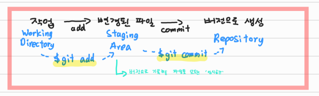

# 📝 Git


## ✔️ Git이란?

> Git은 분산 버전관리 시스템
>
> 버전관리?  →  버전: 컴퓨터 software의 특정 상태


## ✔️ Git Bash를 활용하기 위한 기본 개념

> CLI : Command Line Interface (명령어로써 줄로 조작)
>
> 컴퓨터에 명령을 하는 것


### 📌 CLI 명령어

> $ : Bash에서 명령어 쓰는 곳

- **pwd** (print working directory) : 현재 directory 출력 				→  directory = 폴더/파일
- **cd** (change directory) : 디렉토리 이동                                         →  cd .. = 뒤로가기
- **ls** (list) : 목록
- **mkdir** (make directory) : 폴더 생성
- **touch** : 파일 생성
- **/** : 뛰어 쓰기 공백
- **rm** (remove) : 파일 지우기 / **rm -r 폴더이름** : 파일 지우기


## ✔️ Git 기초 흐름

> 컴퓨터 파일의 변경사항을 추적하고 여러 명의 사용자들 간에 해당 작업을 조율할 수 있다



- **Working Directory** : 작업(수정)한 파일
- **Staging  Area** : 버전으로 기록할 파일을 모으는 '임시공간'
- **Repository** : 버전들이 기록되는 곳


### 📌 버전 기록하기

1. **$ git init**

   ```bash
   # git init을 입력하면, 이후에 (master)가 표기됨
   # 그러면 .git 폴더가 생성된 것
   ADMIN@LAPTOP-M3AAIA8I MINGW64 ~/OneDrive/Desktop/TIL (master)
   $ git init
   Reinitialized existing Git repository in C:/Users/ADMIN/OneDrive/Desktop/TIL/.git/
   ```

​	*만약 (master)가 생성이 안 될 경우*     아래 내용 추가

​	`$ git config --global user.name 'Github username'`

​	`$ git config --global user.email 'Github email'`


2. **$ git status** (변경된 것이 있는지 확인이 가능)

   ```bash
   $ git status
   On branch master
   Changes not staged for commit:
     (use "git add <file>..." to update what will be committed)
     (use "git restore <file>..." to discard changes in working directory)
           modified:   markdown/Git.md
   
   Untracked files:
     (use "git add <file>..." to include in what will be committed)
           markdown/Git.assets/
   
   no changes added to commit (use "git add" and/or "git commit -a")
   
   # 여기서 modified (수정), untracked file (새로 발견된 파일)이 빨간색으로 기록된다
   # 수정된, 새로운 파일들은 현재 Working directory에 있지만, 'git add'를 통해 Staging Area로 보낸다
   ```

   

3. **$ git add 파일 이름 / $ git add . (전체 다 수정 할 때에)**

   ```bash
   ADMIN@LAPTOP-M3AAIA8I MINGW64 ~/OneDrive/Desktop/TIL (master)
   $ git add .
   
   # 
   
   ADMIN@LAPTOP-M3AAIA8I MINGW64 ~/OneDrive/Desktop/TIL (master)
   $ git status
   On branch master
   Changes to be committed:
     (use "git restore --staged <file>..." to unstage)
           new file:   "markdown/Git.assets/\355\231\224\353\251\264 \354\272\241\354\262\230 2022-07-05 171325.png"
           modified:   markdown/Git.md
           
   # git add를 입력 후 git status를 쓰면 빨간색에서 초록색으로 빠귄다
   # new file + modified 초록색으로 보인다
   ```

   

4. **$ git commit -m '커밋 메시지'**

5. **$ git log**


