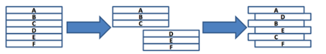

# 🧑‍💻알고리즘 모의고사 2🧑‍💻

[11856 반반](#11856-반반)

[4406 모음이 보이지 않는 사람](#4406-모음이-보이지-않는-사람)

[3499 퍼펙트 셔플](#3499-퍼펙트-셔플)

[1208 Flatten](#1208-flatten)

[7465 창용 마을 무리의 개수](#7465-창용-마을-무리의-개수)


### 11856 반반

길이 4의 알파벳 대문자로 이루어진 문자열 S가 주어졌을 때, S에 정확히 두 개의 서로 다른 문자가 등장하고, 각 문자가 정확히 두 번 등장하는 지 판별하라.

```python
T = int(input())

for t in range(1, T + 1):
    S = input()

    al_cnt = {}
	
    # 딕셔너리에 알파벳 넣기
    for s in S:
        if s in al_cnt:
            al_cnt[s] += 1
        else:
            al_cnt[s] = 1
    
    # result 안에 value 값이 2인 key가
    # 2개가 있으면 참이고, 그 외는 거짓이다
    result = []
    for key, value in al_cnt.items():
        if value == 2:
            result.append(key)

    if len(result) == 2:
        print(f'#{t} Yes')
    else:
        print(f'#{t} No')
```

#### 🚨🚨🚨Main Point🚨🚨🚨

**제일 중요한 것은 알파벳 2개가 2개씩 나와야 한다 **

- 딕셔너리에 입력된 알파벳을 넣는다. key는 알파벳, value는 알파벳의 개수
- 그리고 value가 2개로 나온 알파벳들을 다시 리스트에 넣는다
- 결과적으로 리스트 안에 알파벳이 2개가 있으면 정답이 된다


### 4406 모음이 보이지 않는 사람

알파벳에서 모음은 ‘a’, ‘e’, ‘i’, ‘o’, ‘u’의 다섯가지로 예를 들어 “congratulation”이라는 단어를 당신이 보게 되면 “cngrtltn”으로 인식하게 될 것이다.

```python
T = int(input())

vowel = 'aeiou'

for t in range(1, T + 1):
    word = input()

    # 모음이 없는 letter들만 new_word에 넣기
    new_word = []
    for i in word:
        if i not in vowel:
            new_word.append(i)
    
    result = ''.join(new_word)
    print(f'#{t} {result}')
```

#### 🚨🚨🚨Main Point🚨🚨🚨

**글자에 들어간 모음들을 빼낸다**

- for문을 통해서 입력된 글자를 순회한다
- 그중 모음들이 들어간 `vowel` 변수와 비교를 하여, 모음이 아닐 경우에만 따로 리스트에 넣는다
- 그 리스트는 모음이 없는 단어가 된다 


### 3499 퍼펙스 셔플

카드를 퍼펙트 셔플 한다는 것은, 카드 덱을 정확히 절반으로 나누고 나눈 것들에서 교대로 카드를 뽑아 새로운 덱을 만드는 것을 의미한다.



```python
from collections import deque

T = int(input())

for t in range(1, T + 1):
    # 카드 개수
    N = int(input())

    # 카드 종류
    cards = list(input().split())

    # 반으로 가르기 위해
    num = N // 2

    # 임시적으로 넣어줄 리스트 생성
    temp = []
    for _ in range(num):
        p = cards.pop()
        temp.append(p)

    cards = deque(cards)

    # 결과 값을 넣어줄 리스트
    result = []
    while len(cards) != 0:
        card = cards.popleft()
        result.append(card)
        
        if len(temp) != 0:
            tem = temp.pop()
            result.append(tem)
        else:
            break

    result = ' '.join(result)
    print(f'#{t} {result}')
```

#### 🚨🚨🚨Main Point🚨🚨🚨

**처음 주어진 입력들을 반으로 쪼갠 후 사이사이에 넣는 것**

- 카드를 반으로 쪼개기 위해 카드 수를 반으로 나눴다.
  - 홀수일 때에는 앞에 카드들이 하나 더 많게 함
- 뒤에 카드들을 `temp`라는 리스트에 저장해 둠
  - 여기서 `.pop()`을 했기 때문에 `temp` 리스트에는 반대로 저장이 되어 있음

예) `cards = [A, B, C, D, E]` → `cards = [A, B, C] / temp = [E, D]`

- 두 개의 리스트를 이제 하나의 결과 리스트에 넣는다
  - 여기서 `cards`에서 맨 앞에서 `.pop()`을 해야 하지만 time complexity를 줄이기 위해 `.popleft()`를 사용 
    - 즉 `cards`를 `deque`로 만들었다
  - `cards` 는 `.popleft()`를 하고, `temp`는 그냥 `.pop()`을 한 후 `.append()`를 통해 `result`에 저장
  - 단 끝나는 것은 두 리스트들의 값들이 다 없어졌을 때에 `while`문을 끝낸다


### 1208 Flatten

제일 위에 있는 상자를 제일 낮은 곳에 놓는다. 이게 덤프 한 번을 한 것.

덤프 횟수가 주어지고, 상자의 높이들이 최대한 같아지게 만드는데, 덤프 횟수가 끝나고 난 후 최고점과 최저점의 차이를 구하는 것

```python
for t in range(1, 11):

    C = int(input())
    area = list(map(int, input().split()))

    cnt = 0

    while cnt != C:
        tall = max(area)
        if len(set(area)) == 1:
            break
        else:
            for i in range(len(area)):
                if area[i] == tall:
                    area[i] = area[i] - 1
                    break
            
            short = min(area)                    
            for j in range(len(area)):
                if area[j] == short:
                    area[j] = area[j] + 1
                    cnt += 1
                    break
        
    result = max(area) - min(area)
    print(f'#{t} {result}')
```

#### 🚨🚨🚨Main Point🚨🚨🚨

**리스트를 활용해서, 제일 큰 수에서 1을 빼주고, 제일 작은 수에 1을 더해 주는 것을 반복**

- `while문`을 써서 `cnt`와 덤프 횟수가 같아질 때까지 실행
  - 단 모든 높이들이 같아지면 반복문을 끝낸다
    - `if len(set(area)) == 1:`
- `cnt` 를 세는 것
  - 리스트 안에 제일 큰 값을 구해서, 그 값을 1로 빼고
  - 리스트 안에서 제일 작은 값을 구해서, 그 값을 1로 더하는 것


### 7465 창용 마을 무리의 개수

창용 마을에는 N명의 사람이 살고 있다. 사람은 편의상 1번부터 N번 사람까지 번호가 붙어져 있다고 가정한다.

두 사람이 서로 아는 관계이거나 몇 사람을 거쳐서 알 수 있는 관계라면, 이러한 사람들을 모두 다 묶어서 하나의 무리라고 한다.

창용 마을에 몇 개의 무리가 존재하는지 계산하는 프로그램을 작성하라.

```python
T = int(input())

for t in range(1, T + 1):
    # N = 사람의 수 / M = 간선
    N, M = map(int, input().split())

    rel = [[] for _ in range(N)]
    know = [False] * (N)

    for _ in range(M):
        v1, v2 = map(int, input().split())

        # 관계의 수만 나타내면 되니깐,
        # 원래 인덱스를 활용하는게 더 쉽다 (개인적)
        v1 = v1 - 1
        v2 = v2 - 1
        rel[v1].append(v2)
        rel[v2].append(v1)

    cnt = 0
    for i in range(len(know)):
        if know[i] == False:
            stack = [i]
            know[i] = True

            cnt += 1

            while len(stack) != 0:
                current = stack.pop()

                for cur in rel[current]:
                    if not know[cur]:
                        know[cur] = True
                        stack.append(cur)
    
    print(f'#{t} {cnt}')
```

#### 🚨🚨🚨Main Point🚨🚨🚨

**DFS가 몇 번 돌아가는지 구하면 된다**

- 즉 DFS가 한번 돌아갈 때에, 이미 방문한 곳은 `True`로 저장을 한다
- 모든 정점들이 연결이 되어 있으면 `know` 리스트 원소들은 모두 `True`일 것이다
- 하지만 한번 돌았는데 `False`가 있다는 것은, 또 연결할 곳이 있는 것
  - 즉 또 DFS를 실행해야 하는 것이다