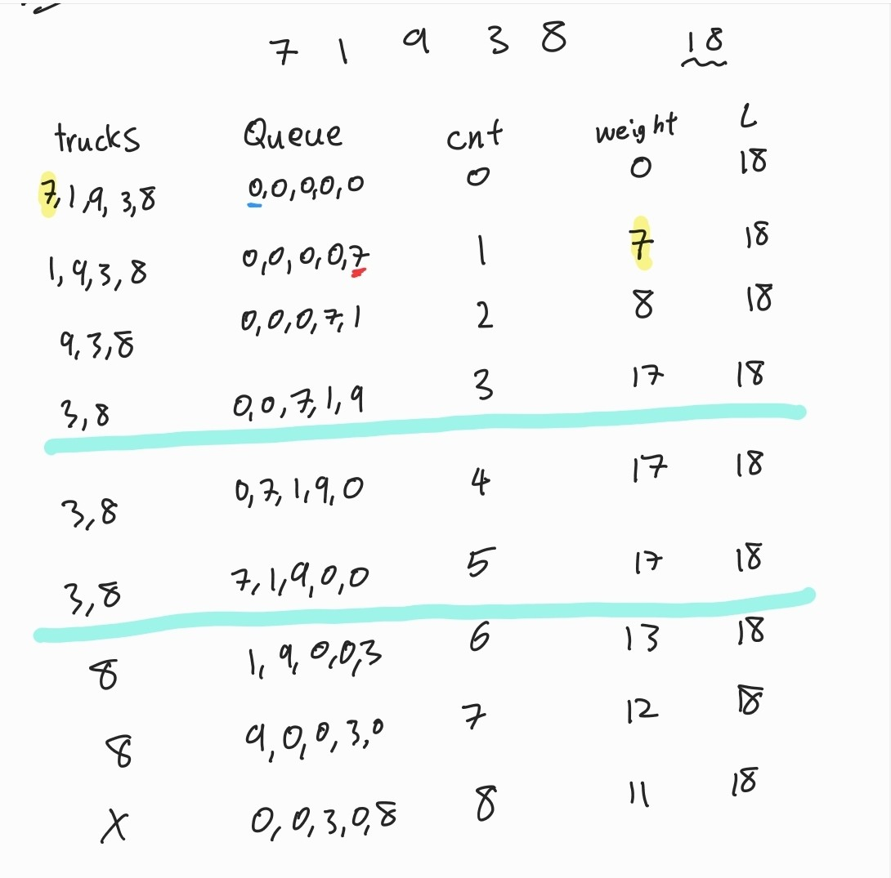

# 🧑‍💻 알면 좋은 것들

## Category

[SET](#set)

[Heapq](#heapq)

[Queue](#queue)

[DFS 구현 방식](#DFS-구현-방식)

[재귀 함수](#재귀-함수)

- [팩토리얼](#팩토리얼)
- [피보나치 수](#피보나치_수)


## SET

### 교집합, 합집합, 차집합

**교집합**

```python
set1 = set([1, 2, 3, 4, 5])
set2 = set([3, 4, 5, 6, 7])

print(set1 & set2)
# {3, 4, 5}
```

**합집합**

```python
set1 = set([1, 2, 3, 4, 5])
set2 = set([3, 4, 5, 6, 7])

print(set1 | set2)
{1, 2, 3, 4, 5, 6, 7}
```

**차집합**

```python
# set1에만 있는 숫자
set1 = set([1, 2, 3, 4, 5])
set2 = set([3, 4, 5, 6, 7])

print (set1 - set2)
# {1, 2}
```

**대칭차집합**

```python
# 교집합이 아닌 숫자들
set1 = set([1, 2, 3, 4, 5])
set2 = set([3, 4, 5, 6, 7])

print(set1 ^ set2)
# {1, 2, 6, 7}
```


## Heapq

> 해당 문제는 숫자를 하나씩 array에 넣고, heapify를 하는 것
>
> 1. 0 이 나오면 숫자를 출력한다
>    1. 만약 0이 나왔는데 array에 숫자가 없으면 0을 출력
> 2. array 중 제일 큰 숫자를 출력

```python
import heapq

array = []
heapq.heapify(array)

N = int(input())

for i in range(N):
    x = int(input())
    if x == 0:
        if len(array) == 0:
            print(0)
        else:
            # 출력할 때에는 x를 다시 양수로 바꾼다
            print(-heapq.heappop(array))
    else:        
        # 입력된 x 를 음수로 만들어서 array에 넣는다
        heapq.heappush(array, -x)
```

- 기본적으로 heapq은 파이썬에서 최소 힙으로 설정이 되어있다
  - 그래서 여기서 최대힙을 구하려면 array에 있는 숫자들을 다 음수로 만들어버리면 된다

- 예를 들면 `[5, 3, 2, 6]`이 있음
  - 그냥 heapq을 써서 한 숫자씩 꺼냈을 경우
    - `2, 3, 5, 6` 순으로 출력이 된다
  - 반대로 최대 힙으로 양수가 아닌 상태에서 출력했을 때
    - `-6, -5, -3, -2` 순으로 출력이 된다
    - 위에 숫자들을 다시 양수로 바꿔주면 내림차순으로 출력이 된다


#### 11286 절대값 힙

> 이 문제는 배열이 있을 때에, 먼저 절대값 위주로 작은 수를 구하고난 후, 숫자들 중 같은 숫자가 있으면, 원래 숫자에서 더 작은 숫자를 구한다

예) 1, 2, 3, 4, -1, -2, -6

- 절대값으로만 보면 1, 1, 2, 2, 3, 4, 6
- 절대값으로 정렬한 후 같은 같은 숫자들끼리 비교를 하면
  - -1, 1, -2, 2, 3, 4, -6  `정답`

```python
import heapq

T = int(input())
array = []

heapq.heapify(array)

for _ in range(T):
    x = int(input())
    # 튜플로 넣기
    # 그럼 heapify를 했을 때 num[0]을 먼저 정렬하고
    # 거기서 같을 경우 num[1]끼리 비교한다
    num = (abs(x), x)

    if x == 0:
        if len(array) != 0:
            a = heapq.heappop(array)
            print(a[1])
        else:
            print(0)
    else:
        heapq.heappush(array, num)
```

- 🚨🚨 **중요한 포인트** 🚨🚨
  - 튜플에 입력값들을 배열에 저장한다
  - 그러면 num[0] 즉 절대값끼리 비교를 먼저 한다
    - num[0] : 입력값의 절대값
  - 그리고 절대값 중, 같은 값이 있으면 num[1]끼리 비교를 한다
    - **num[1] : 입력값 (나중에 출력해야 하는 값)**


## Queue

#### 13335 트럭

```python
from collections import deque

n, w, L = map(int, input().split())

trucks = deque(list(map(int, input().split())))

queue = deque([0] * w)
cnt = 0
weight = 0

while queue:
  cnt += 1

  if trucks:
    weight -= queue.popleft()
    if weight + trucks[0] <= L:
      weight += trucks[0]
      queue.append(trucks.popleft())

    else:
      queue.append(0)

  else:
      queue.popleft()

print(cnt)
```



> `queue` 있는 요소들을 하나씩 빼면서 진행하는 것
>
> weight에는 `queue` 안에 있는 트럭의 무게이다
>
> 일단 `queue`에 하나씩 뺀다 (만약 트럭이 남아있으면, 뒤에 트럭이 들어갈 것이고, 건널 트럭이 없으면 `queue`가 없어질때까지 진행 하면 된다)
>
> `queue`에서 숫자를 뺼때마다 weight에 뺀 숫자를 빼준다
>
> - 그리고 뺀 weight과 다리 위에 있는 트럭들의 무게를 구한다
>   - 그리고 weight과 다음에 들어올 트럭의 무게가 최대 하중보다 적으면, 그 트럭을 다리 위에 놓는다
>   - 그게 아니면 weight과 다음 들어올 트럭의 무게가 최대 하중보다 적을때까지, `queue.popleft` 통해 트럭들을 전진시키고, `queue.append(0)`을 통해 뒤의 다리 길이를 채워준다


## DFS 구현 방식

[DFS BFS 문제 꼭 한번 보면 좋은 것](https://github.com/jejoonlee/baekjoon/blob/master/2.Silver/2.Silver_2_1260_DFS%2CBFS.py)

```python
def dfs(start):
    stack = [start]
    # 현재 정점 방문 처리
    visited[start] = True
    
    # while문으로 스택이 없어질 때까지 진행을 한다
    # while문이 끝났다는 것은, 모든 연결된 정점들이 확인이 되었다는 것
    while stack:
    	# 현재 정점을 스택에서 가지고 온다
    	current = start.pop()
    	
        # graph에서 current 인덱스인 값들을 가지고 온다
    	for adj in graph[current]:
            # visited[adj] 가 False면 True로 변환하고, 스택에 넣는다
            if visited[adj] == False:
                visited[adj] = True
                stack.append(adj)
                # while문이 계속 돌아갈 수 있도록
```


## 재귀 함수

#### 팩토리얼

```python
def factorial(N):
    if N <= 1:
        return 1
    else:
        return N * factorial(N - 1)
        # N! = N * (N-1)!
        # N과 factorial 함수에 n - 1을 넣어서 반환된 값을 곱한다

print(factorial(5))
```

- 재귀 함수를 먼저 호출하면서 stack에 넣는다
  - 예시) [(5 * factorial(4)) , (4 * factorial(3)) , (3 * factorial(2)), (2 * factorial(1)), (factorial(1) return 1)]
    - 마지막은 값이 1이기 때문에 함수 호출을 끝낸다 `n <= 1`
- 호출이 끝내면 stack에서 꺼내면서 반환을 시켜준다
  - (factorial(1) return 1) = 1
  - (2 * factorial(1)) = 2
  - (3 * factorial(2)) = 6
  - (4 * factorial(3)) = 24
  - (5 * factorial(4)) = 120

#### 피보나치 수

```python
N = int(input())

def fibo(n):
    if n == 1 or n == 2:
        return 1
    else:
        return fibo(n - 1) + fibo(n - 2)

print(fibo(N))
-----------------------------------------------

a, b = 0, 1
for _ in range(N):
    a, b = b, b + a
print(a)
```

- 재귀 함수로 풀면 시간 복잡도가 증가한다
- for문으로 풀었을 때
  - a, b를 0, 1로 시작한다
  - for문을 돌때, a는 b가 되고, b는 a와 b를 더한 변수가 된다


#### 하노이 탑

> 1. 원반은 위에서부터 꺼낼 수 있고, 하나씩 꺼내야 한다
>
> 2. 항상 작은 원반이 위에 있어야 한다

- **중요 포인트**
  - 맨 밑에 있는 원반이 목적지에 가야하고, 그 위에 있는 원반들을 보조 기둥에 넣는다

