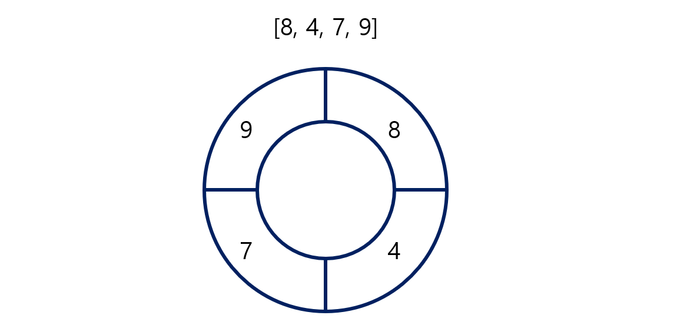

# Programmers 2 레벨 테스트 2


## 문제



배열에 숫자들이 주어진다.

위에 그림처럼 배열은 원형으로 이루어져있다.

배열 안에 있는 연속된 숫자들을 더해서, 더한 숫자들의 개수를 구하는 것

예를 들어

- 연속된 숫자 하나 : [4], [7], [9], [8]
- 연속된 숫자 둘 : [8, 4], [4, 7], [7, 9], [9, 8]
- 연속된 숫자 셋 : [8, 4, 7], [4, 7, 9], [9, 8, 4]
- 연속된 숫자 넷 : [8, 4, 7, 9]
  - 위의 숫자들을 더하고, 반복된 숫자들을 제거 후, 개수를 세면 된다


## 문제 풀이

- 더한 숫자들은 `set()`에 넣을 것
  - 그렇게 해야, 반복된 숫자들을 알아서 없앨 수 있다
- 배열 `elements`가 주어지는데 `elements + elements`를 해서, 배열을 두 배로 늘려 `new_element`를 만든다
  - 연속된 숫자들을 더할 때에, `new_element` 이상으로 넘어갈 수 없다
  - 이렇게 안 하면, 인덱스 초과가 뜬다
- `for문`으로 몇 개의 숫자들을 연속해서 더해야 하는지 구한다
- `while문`에서는 `new_element[j: j + i + 1]` 즉 슬라이싱을 통해, 연속된 숫자들을 가지고 온다
  - 그리고 그 숫자들을 다 더해서 `set()`에 넣는다
- 모든 것이 끝나면, `set()`의 길이를 출력하면 된다


## 코드

```python
def solution(elements):
    answer = 0
    add_numbers = set()

    new_element = elements + elements

    for i in range(0, len(elements)):
        j = 0

        while j < len(elements):
            add_numbers.add(sum(new_element[j: j + i + 1]))
            j += 1

    answer = len(add_numbers)

    return answer
```

