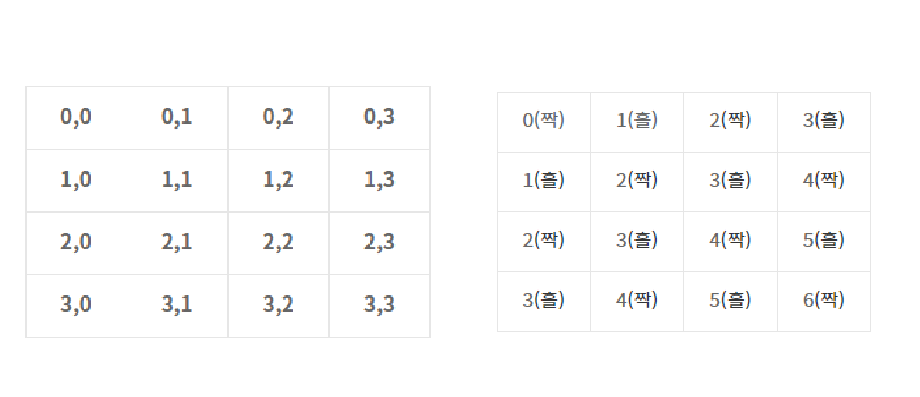

# ✍️ SWEA D3 알아두면 좋은 것


### 14413 격자판 칠하기 (인덱스 더해서 짝,홀 나누기)

> `?` 은 흰색 또는 검정 중 아무거나 칠할 수 있어서 신경 안 써도 됨
>
> `.` 은 흰색 / `#` 은 검정색
>
> 흰색과 검정색이 양옆에 있으면 안 된다. 즉 흰색이 짝수면, 검정색은 무조건 홀수 쪽에 있어야 한다. 반대로 검정색이 짝수면 흰색은 무조건 홀수 쪽에 있어야 한다.

이것을 구하기 위해서는 행과 열을 더해서 2로 나눠야 한다. `(row + column) / 2`



```python
T = int(input())

for t in range(T):
    N, M = map(int, input().split())

    board = [input() for _ in range(N)]
    
    # answer[0] : '.' 이 짝수일때 1씩 누적
    # answer[1] : '.' 이 홀수일때 1씩 누적
    # answer[2] : '#' 이 짝수일때 1씩 누적
    # answer[3] : '#' 이 홀수일때 1씩 누적
    answer = [0, 0, 0, 0]

    for row in range(N):
        for col in range(M):

            if board[row][col] == '.':
                if (row + col) % 2 == 0:
                    answer[0] += 1
                else:
                    answer[1] += 1
            
            elif board[row][col] == '#':
                if (row + col) % 2 == 0:
                    answer[2] += 1
                else:
                    answer[3] += 1

    # '.'이 짝수 지역에도 있고 홀수 지역에도 있을 때
    # '#'이 짝수 지역에도 있고 홀수 지역에도 있을 때
    # '.'과 '#' 둘 모두 짝수 지역에 있을 때
    # '.'과 '#' 둘 모두 홀수 지역에 있을 때
    if (answer[0] and answer[1]) or (answer[2] and answer[3]) or (answer[0] and answer[2]) or (answer[1] and answer[3]):
        print(f'#{t + 1} impossible')
    else:
        print(f'#{t + 1} possible')
```

- 처음 풀이에서는 그냥 가로 쪽만 생각하고 `.` 과 `#` 이 안 붙어있을 경우만 생각했다
- 알고 보니, 체스판처럼 양옆과 위아래로 흰색과 검정색이 겹치면 안 되는 문제였다
- 위의 그림처럼 이중 for문을 돌면서 짝과 홀의 zone을 `(row + col) % 2` 로 구했다
- **중요 포인트**
  - `.` 이 짝수이면 `#`는 홀수이어야 한다
    - 즉 `.`가 짝수일 때, `.` 는 홀수 지역에 있을 수 없고, `#`는 짝수 지역에 있으면 안 된다
      - `answer[0] and answer[1]` 과 `answer[0] and answer[2]` 일 경우 답은 `impossible`
        - `answer[0]` 에 **1**이 누적이 되어 있으면 `answer[1]`과 `answer[2]`에 값이 **0** 이어야 `possible`이 된다
    - 즉 `#`가 짝수일 때, `#` 는 홀수 지역에 있을 수 없고, `.`는 짝수 지역에 있으면 안 된다
      - `answer[2] and answer[3]` 과 `answer[1] and answer[3]` 일 경우 답은 `impossible`
        - `answer[2]` 에 **1**이 누적이 되어 있으면 `answer[0]`과 `answer[3]`에 값이 **0** 이어야 `possible`이 된다