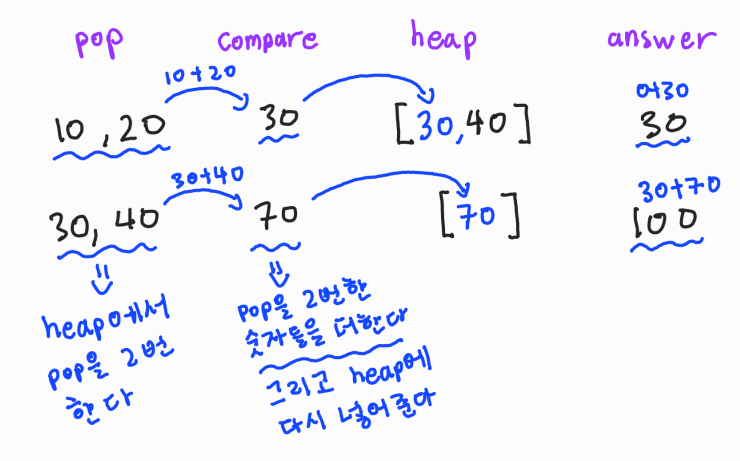

# 🧑‍💻 [Python] 백준 1715 - 카드 정렬하기

### Gold 4 - 그리디, 힙


#### heappop을 2번씩 해서, 나온 숫자들을 더해준다

#### 더해준 숫자들을 다시 heap에 넣어준다

#### 이것을 heap에 숫자가 2개 미만일 때까지 반복해서 해준다





#### 문제풀이

- 힙에서 2개의 숫자를 pop으로 뽑아와서, 더해주는 것이다
- 제일 낮은 숫자끼리 더하면, 최소 숫자를 만들 수 있다


## 코드

```python
import heapq

N = int(input())

heap = []

for n in range(N):
    heapq.heappush(heap, int(input()))

answer = 0

while True:

    if len(heap) <= 1:
        break
    else:
        compare = 0
        for _ in range(2):
            cards = heapq.heappop(heap)
            compare += cards

        answer += compare
        heapq.heappush(heap, compare)
        
print(answer)
```

