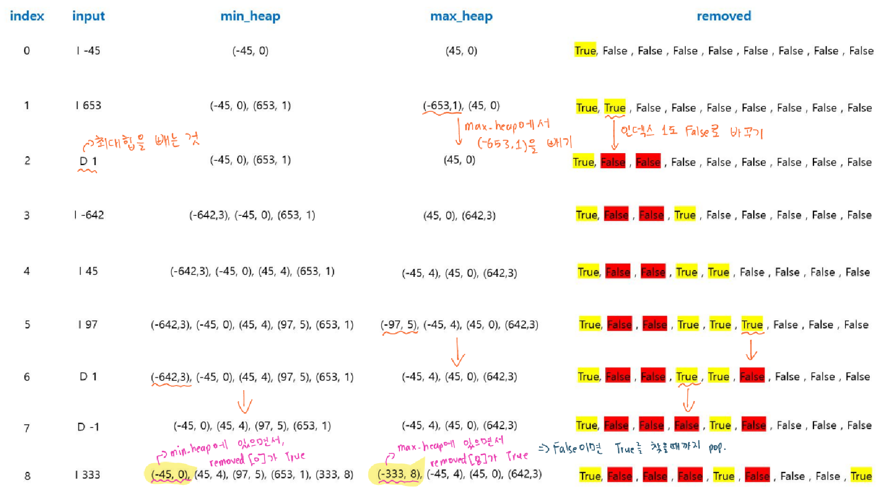

# 🧑‍💻 [Python] 백준 7662 이중 우선순위 큐

### Gold 4 - Heapq


#### 최소 힙과, 최대 힙을 사용하는 문제이다

#### 두 개의 힙을 사용하면서, 숫자 관련된 참/거짓의 여부도 파악해야 한다

#### 처음에는 두 힙에 숫자 하나가 모두 들어간다

#### 그리고 숫자를 하나씩 뺄 때에는, 하나의 힙에는 그 숫자가 남게 된다

- True의 경우는, 두 개의 힙에 동일한 숫자가 있을 경우를 True로 넣는다

#### `I` 는 힙에 숫자를 넣는 것  / `D 1` 최대 힙에서 숫자를 하나 빼는 것 /  `D -1` 최소 힙에서 숫자를 하나 빼는 것




#### 문제풀이

- 명령어 `I` 또는 `D`를 제일 먼저 확인 한다
- `I`일 경우, 최대 힙과, 최소 힙에 숫자와 인덱스를 튜플로 넣는다
  - **숫자** : 최대 힙과 최소 힙에서, 숫자들끼리 비교를 해야 함
  - **인덱스** : True/False 여부를 위해, `removed`의 인덱스이다

- `D`일 경우, `-1` 이면 최소 힙에서 숫자를 빼주고, `1`이면 최대 힙에서 숫자를 빼준다
  - 단! 최소 힙에서 숫자를 뺐는데, 그 전에 최대 힙에서 뺐던 숫자일 수도 있다
    - 즉 `removed`의 값이 **False**라는 것
    - 이럴 때에는 계속 최소 힙에서 숫자를 빼준다
    - `min_heap`에서 원소가 아예 없어지거나, **True**를 찾아서, **False**로 값을 바꿨을 때, while문을 빠져나가게 된다

  - `1`일 경우, 위에 최소 힙에서 했던 것을 최대 힙에서 해주면 된다

- 이렇게 다 끝내고, 결과물을 만들기 위해 `min_heap`에 있는 숫자들 중에, `max_heap`에서 한번도 안 뺐던 숫자 / `max_heap`에 있는 숫자들 중에, `min_heap`에서 한번도 안 뺐던 숫자를 찾는다


## 코드

```python
import heapq

T = int(input())

for _ in range(T):

    N = int(input())

    max_heap, min_heap = [], []
    removed = [False] * N

    for n in range(N):
        command, num = map(str, input().split())

        if command == 'I':
            heapq.heappush(max_heap, (-int(num), n))
            heapq.heappush(min_heap, (int(num), n))
            
            # True면 숫자가 max_heap, min_heap에 모두 있다는 것
            removed[n] = True

        if command == 'D':
            if num == '-1':
                # min_heap에 아이템이 있을 때에
                # removed에서 True가 있으면, min_heap에서 빼고, False로 바꾼다
                while min_heap:
                    number, index = heapq.heappop(min_heap)

                    if removed[index] == True:
                        removed[index] = False
                        break
            
            else:
                while max_heap:
                    number, index = heapq.heappop(max_heap)

                    if removed[index] == True:
                        removed[index] = False
                        break


    while min_heap and removed[min_heap[0][1]] == False:
        heapq.heappop(min_heap)
    while max_heap and removed[max_heap[0][1]] == False:
        heapq.heappop(max_heap)

    if min_heap and max_heap:
        print(-max_heap[0][0], min_heap[0][0])
    else:
        print("EMPTY")
```

