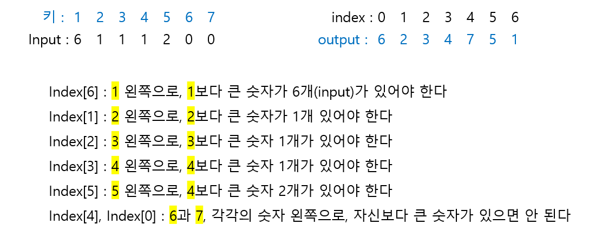

# 🧑‍💻 [Python] 백준 1138 한 줄로 서기

### Gold 4 - 그리디


#### 입력값은 서있는 사람의 기준으로 왼쪽에, 자신보다 키가 큰 사람의 숫자를 의미한다

- 예) 키가 1인 사람 왼쪽에는 자신보다 큰 사람이 6명이 있다





#### 문제풀이

- `result`의 0의 개수를 세면서, `index + 1` 즉 키를 넣어주면 된다


## 코드

```python
N = int(input())

result = [0] * N

for index, num in enumerate(list(map(int, input().split()))):
    cnt = 0
    i = 0
    while True:
        if result[i] == 0 and cnt == num:
            result[i] = index + 1
            break
        elif result[i] == 0:
            cnt += 1
        i += 1
        
print(' '.join(map(str,result)))
```

