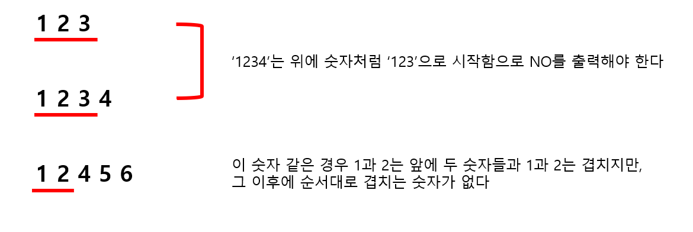

# 🧑‍💻 백준 5052 - 전화번호 목록

### GOLD 4


### 접두어가 있으면 NO를 출력하고 없으면 YES를 출력하는 문제

>  여기서 접두어(Prefix)란?
>
> 어떤 단어 또는 숫자 앞에 새로운 단어 또는 숫자가 되는 것


예시)



#### 문제 풀이

1. 숫자들을 **integer**로 입력을 받아오는 것이 아닌, 문자열로 불러온다
   - 숫자의 원래 크기가 중요한 것이 아닌, 문자열에 있는 앞의 숫자들이 문자열을 비교할 때에 일치가 하는지가 중요하다!
2. 숫자들을 정렬을 시킨다
   - 문제의 예시를 정렬하게 된다면
     - '911', '97625999', '91125426' 	 ▶️	 `['911', '91125426', '97625999']`
     - '113', '12340', '123440', '12345', '98346'      ▶️      `['113', '12340', '123440', '12345', '98346']`
3. 정렬을 하고 숫자들을 순회하는데, 현재 문자열과, 그 다음 문자열만 비교를 한다


#### 코드

```python
T = int(input())

for _ in range(T):
    N = int(input())

    phone = []

    for n in range(N):
        phone.append(input())
        flag = True

    phone.sort()

    for p in range(len(phone) - 1):
        if phone[p] == phone[p + 1][0:len(phone[p])]:
            flag = False
            break

    if flag == False:
        print('NO')
    else:
        print('YES')
```

`phone[p] == phone[p + 1][0:len(phone[p])]` 

- 현재 문자열과 뒤의 문자열을 비교한다
- 비교 했을 때에, 현재 문자열의 길이가 뒤의 문자열의 길이보다 짧아야 된다
- 그리고 뒤에 있는 문자열의 앞 부분이 현재 문자열과 일치하게 된다면 접두어로 `NO`를 출력해야 한다