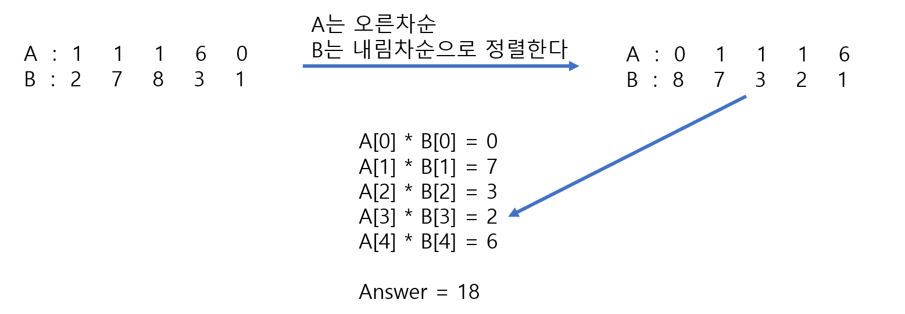

# 🧑‍💻 [Python] 백준 1026 보물

### Silver 4 - 그리디


#### A는 재배열이 가능하고, B는 재배열을 하면 안 된다고 하지만, 둘 다 정렬을 해야 한다

#### A는 오름차 순으로, B는 내림차 순으로 정렬을 해야 한다




#### 문제풀이

- A는 오름차순으로 B는 내림차순으로 정렬을 한다
  - 즉 나중에 같은 인덱스끼리 곱할 때, A의 작은 수는 B의 큰 수와 곱한다
  - 그리고 그것을 나중에 다 더하면 최소 값이 된다


## 코드

```python
N = int(input())

A = list(map(int, input().split()))
B = list(map(int, input().split()))

A.sort()
B.sort(key=lambda x: -x)
answer = 0

for i in range(N):
    answer += A[i] * B[i]

print(answer)
```


