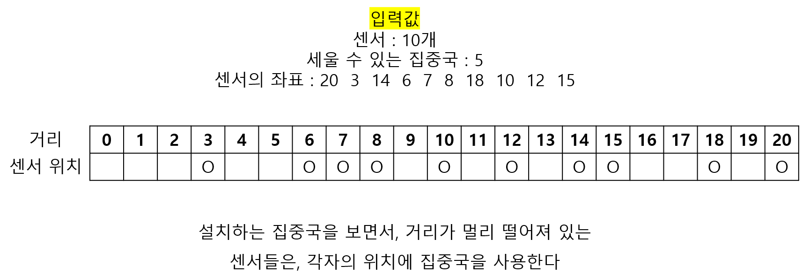

# 🧑‍💻 [Python] 백준 2212 센서

### Gold 5 - 그리디


#### 




#### 문제풀이

- 센서들을 내림차순으로 정렬을 한다
- 그리고 센서들 사이의 거리를 계산해서 새로운 리스트에 넣는다
- 그 리스트를 오름차순으로 정렬을 하고, 세울 수 있는 집중국에서 1을 뺀만큼, 리스트에서 거리를 빼준다
  - 거리를 빼면, 해당 센서는, 자기 자신만의 집중국을 가지는 것이


## 코드

```python
censor_num = int(input())
center_num = int(input())
censors = list(map(int, input().split()))
censors.sort(reverse=True)


# 설치할 수 있는 집중국이 센서보다 많거나, 같으면,
# 각 센서에게 집중국을 설치하면 된다
if censor_num <= center_num:
    print(0)
else:
    distance = [censors[i - 1] - censors[i] for i in range(1, len(censors))]
    distance.sort()

    for _ in range(center_num - 1):
        distance.pop()

    print(sum(distance))
```


## 코드 2 (힙으로 풀어보기)

```python
import heapq

censor_num = int(input())
center_num = int(input())
censors = list(map(int, input().split()))

if center_num >= censor_num:
    print(0)
else:
    heapq.heapify(censors)

    distance = []
    temp = heapq.heappop(censors)

    while censors:
        current = heapq.heappop(censors)
        heapq.heappush(distance, -(current - temp))
        temp = current

    for _ in range(center_num - 1):
        heapq.heappop(distance)

    print(-sum(distance))
```

- `temp`에 전에 계산 했던 센서들의 위치를 저장하며, 지금 센서와의 거리의 차이를 구한다
  - 이렇게 해야 모든 센서들의 위치의 거리를 구할 수 있다
- 그리고 최대 힙으로 `distance`에 넣어주면 된다
- 마지막으로는 `center_num - 1` 만큼 `distance`에서 `pop`을 해주고, 마지막에 `distance`에 있는 원소들을 다 더해주면 된다


> #### 힙을 추천해주신 SHARK님 감사합니다 🥰

