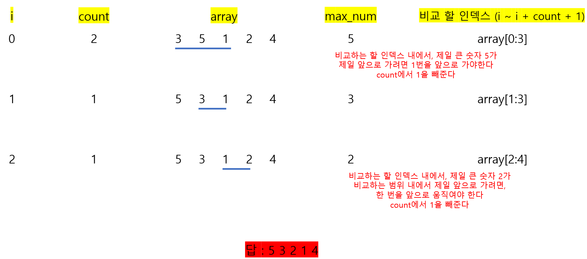

# 🧑‍💻 [Python] 백준 1083 소트

### Gold 5 - 그리디





#### 문제풀이

- 최대한 제일 큰 숫자가 앞으로 와야 한다
- 숫자의 움직임에 제한이 있다
- 일단 `swap`만큼의 숫자들을 슬라이스를 통해 슬라이스 안에 제일 큰 숫자를 가지고 온다
- 그리고 i까지, 뒤로 그 큰 숫자를 앞으로 가지고 온다
- 이것을 `swap`이 0이 될때까지 반복을 한다


## 코드

```python
N = int(input())
array = list(map(int, input().split()))
swap = int(input())

for i in range(N):
    max_num = max(array[i : i + swap + 1])
    max_num_index = array.index(max_num)

    for j in range(max_num_index, i, -1):
        array[j - 1], array[j] = array[j], array[j - 1]

    swap -= max_num_index - i

    if swap <= 0:
        break


print(' '.join(map(str, array)))
```


