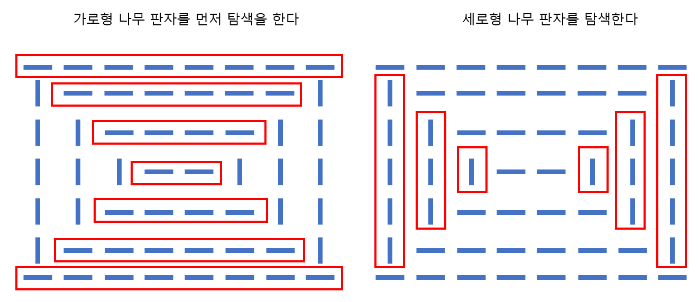

# 🧑‍💻 [Python] 백준 1388 바닥 장식

### Silver 4 - 그래프 탐색


#### 탐색을 두 번 해야한다. 즉 2중 for문을 두번 사용한다.

#### 탐색을 해서 '-' 가 연결되어 있는 나무 판자와 '|'가 열결되어 있는 나무 판자들의 개수를 센다

#### 단 나무 판자의 너비는 1이다





#### 문제풀이

- 2중 for문을 두번 순회를 해야 한다.
  - 첫 번째는 가로형 나무 판자들을 찾는 것이고, 두 번째는 세로형 나무 판자들을 찾는 것이다

- 먼저 `'-'` 이면 계속 순회를 하되, 다음 판자가 `'|'`이면, 그 나무 판자를 `count`에 1을 더해준다
  - 즉 `'|'`이 나타나면, `'-'` 의 연속 된 나무 판자가 끊겼다는 것이다
  - 그리로 2중 for문 중 2번째 for문이 끝나면, 마지막 판자가 `'|'`인지 또는 `'-'`인지 확인해야 한다

- 나무 판자의 너비가 1 이니 `'-'`로 끝나면, `count`에 1을 더해줘야 한다


## 코드

```python
N, M = map(int, input().split())

floor = [input() for _ in range(N)]

count = 0

for i in range(N):
    for j in range(M-1):
        if floor[i][j] == "-" and floor[i][j + 1] == "|":
            count += 1
    if floor[i][-1] == "-":
        count += 1

for j in range(M):
    for i in range(N-1):
        if floor[i][j] == "|" and floor[i + 1][j] == "-":
            count += 1
    if floor[N-1][j] == "|":
        count += 1
        
print(count)
```


