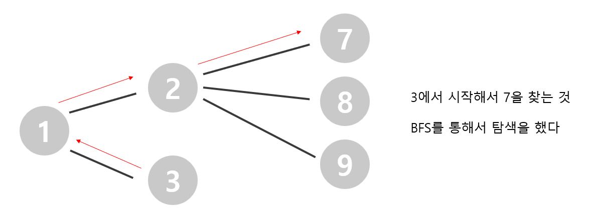

# 🧑‍💻 [Python] 백준 2644 촌수계산

### Silver 2 - DFS / BFS


#### DFS도 사용할 수 있지만, BFS를 이용해서 촌수를 찾았다

#### 부모 노드와 연결되어 있는 노드들을 먼저 탐색을 한다

#### 탐색을 하면서 같은 번호를 찾으면 된다




#### 문제풀이

- BFS를 이용해서, 노드와 연결된 노드들 중에서 `end`와 같은 번호가 있는지 확인을 해야 한다
  
- 여기서 중요한 것은 `while`문에서 그냥 `count`를 넣으면, `queue`에서 뽑을때마다 `count`에 1이 더해진다
  - 이것을 방지하기 위해, `queue`에 튜플 형식으로, (노드번호, 촌수)를 넣는다


## 코드

```python
from collections import deque

n = int(input())
start, end = map(int, input().split())
start, end = start - 1, end - 1
m = int(input())

relations = [[] for _ in range(n)]
visited = [False] * n

for _ in range(m):
    x, y = map(int, input().split())
    relations[x-1].append((y-1, 0))
    relations[y-1].append((x-1, 0))

visited[start] = True
queue = deque([(start, 0)])


while queue:
    current, count = queue.popleft()

    if current == end:
        break

    for cur in relations[current]:
        if visited[cur[0]] == False:
            visited[cur[0]] = True
            queue.append((cur[0], count + 1))

if visited[end] == True:
    print(count)
else:
    print(-1)
```


