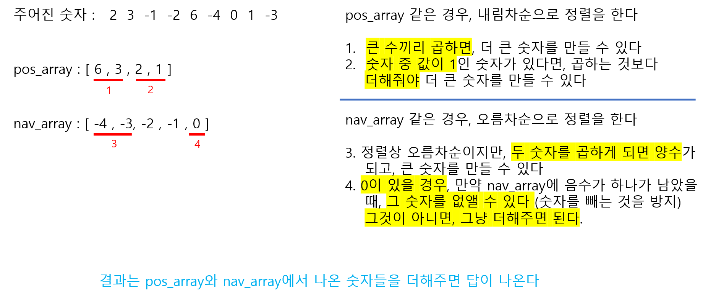

# 🧑‍💻 백준 1744 - 수 묶기

### GOLD 4


### 주어진 숫자들을 더해서 제일 큰 수를 만드는 것

### 숫자들을 2개씩 묶어서 곱할 수 있다

### 즉 큰 숫자들끼리 묶어서 곱하면, 합을 최대로 만들 수 있다





#### 문제 풀이

- 주어진 숫자들을 리스트에 넣을 때에, 양수 리스트와 음수 리스트에 따로따로 넣는다
  - 즉 리스트가 2개다. **여기서 0 은 음수 리스트에 넣는다**
- 양수 리스트는 **내림차순**으로 / 음수 리스트는 **오른차순**으로 정렬을 한다
- deque를 사용한다
  - 이유는 제일 앞에 있는 숫자들을 `pop`을 해야하는데, `pop`은 리스트에 있는 제일 마지막 숫자를 꺼낸다
  - 첫번째 숫자를 빠른 속도록 꺼내기 위해서 `popleft`를 사용해야하는데, `deque`를 적용해야 사용할 수 있음
- while문을 통해 양수 리스트와 음수 리스트에 있는 숫자 꺼내서 더해준다
  - **공통적**인 것은 양수 리스트와 음수 리스트에서 리스트 앞에 숫자를 2개를 꺼낼 수 있으면, 그 숫자들을 곱해서 pos_ans와 nav_ans에 더해준다
    - pos_ans : 양수 를 더하는 변수
    - nav_ans : 음수를 더하는 변수
  - 만약 양수 리스트나 음수 리스트에 숫자가 하나만 남을 경우 pos_ans 또는 nav_ans에 더해준다
  - **양수 리스트**는 추가로 리스트에서 꺼낸 2 숫자 중 값이 `1` 이 있을 경우, 곱하지 않고 더해서 pos_ans와 더한다
- 그리고 pos_ans와 nav_ans를 더해주면 결과값이 나온다


#### 코드

```python
from collections import deque

N = int(input())
pos_array = []
nav_array = []

for _ in range(N):
    num = int(input())
    if num > 0:
        pos_array.append(num)
    else:
        nav_array.append(num)

pos_array.sort(key=lambda x: -x)
nav_array.sort()
pos_array = deque(pos_array)
nav_array = deque(nav_array)

pos_ans = 0
nav_ans = 0

while len(pos_array) != 0 :
    if len(pos_array) != 1:
        a = pos_array.popleft()
        b = pos_array.popleft()
        if a != 1 and b != 1:
            pos_ans += a * b
        elif a == 1 or b == 1:
            pos_ans += a + b
    else:
        a = pos_array.popleft()
        pos_ans += a

while len(nav_array) != 0:
    if len(nav_array) != 1:
        a = nav_array.popleft()
        b = nav_array.popleft()
        nav_ans += a * b
    else:
        nav_ans += nav_array.popleft()

print(pos_ans + nav_ans)
```
