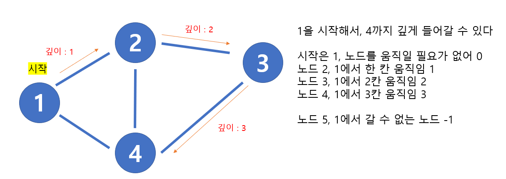

# 🧑‍💻 [Python] 백준 24481 알고리즘 수업 DFS (재귀!!!)

### Silver 2 - DFS





#### 시작 기준에서 각 노드까지 얼마나 걸리는지 찾는 


#### 문제풀이

- 재귀를 이용하여 DFS를 실행한다

```python
sys.setrecursionlimit(10 ** 6)
input=sys.stdin.readline
```

- 재귀를 제한해주는 식이다 (코딩 테스트에서 재귀를 사용할 때에 꼭 필요하다)


## 코드

```python
import sys

sys.setrecursionlimit(10 ** 6)
input=sys.stdin.readline

def dfs(start, count):
    result[start] = count

    for num in tree[start]:
        if result[num] == -1:
            dfs(num, count + 1)

n, m, r = map(int, input().split())

tree = [[] for _ in range(n + 1)]
result = [-1] * (n+1)

for _ in range(m):
    a, b = map(int, input().split())
    tree[a].append(b)
    tree[b].append(a)

for t in tree:
    t.sort()

dfs(r, 0)

for i in range(1, n+1):
    print(result[i])
```


