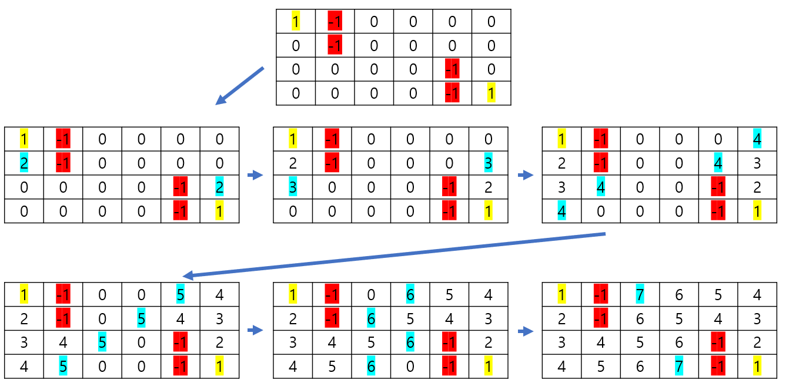

# 🧑‍💻 [Python] 백준 7576 토마토

### Gold 5 - BFS





#### 무조건 BFS로 풀어야 하는 문제이다

#### 시작점이 하나가 아닐 수 있다

- 그래서 queue 안에다 시작점들을 모두 찾아서 넣는다

#### BFS를 할때마다 주변 노드에다 방문 표시 대신 1을 더해서, 더한 숫자를 넣는다

#### 마지막에 다시 탐색을 해야하는데, 0이 하나라도 있으면 -1을 출력하고, 그게 아니면 더한 숫자들 중 제일 큰 숫자에 1을 빼서, 답을 출력한다


#### 문제풀이

- `bfs` 식
  - 주변을 탐색하고, 주변에 있는 노드 위주로 탐색하기 위해 `popleft`를 사용
- 첫 for문
  - `queue`에다가 시작 점들을 넣는다
  - 시작점이 하나일 때에는 for문을 돌릴 필요가 없지만, 이 문제에서는 시작점이 1개 이상이 주어질 수 있다
- 두번째 for문
  - 결과값을 탐색한다
  - bfs를 다 돌고나면, box에 몇 일이 지났는지, 숫자들이 표기되어 있다
  - 각 열을 돌며, 열에서 제일 큰 숫자를 `answer`에 저장을 한다
  - 단, 0이 하나라도 발견이 된다면, `flag`는 False로 바꾼다
    - 이 뜻은, 모든 토마토가 다 익지 못 했다는 것이다
    - 즉 -1을 출력해야 한다


## 코드

```python
from collections import deque


def bfs(queue):
    dr, dc = [-1, 0, 0, 1], [0, -1, 1, 0]


    while queue:
        r, c = queue.popleft()

        for i in range(4):
            sr, sc = dr[i] + r, dc[i] + c

            if 0 <= sr < m and 0 <= sc < n:
                if box[sr][sc] != -1 and box[sr][sc] == 0:
                    queue.append((sr, sc))
                    box[sr][sc] = box[r][c] + 1


n, m = map(int, input().split())

box = [list(map(int, input().split())) for _ in range(m)]

queue = deque([])

answer = 0

# 시작 점들을 queue에다가 넣는다
# 시작 점들이 1개 이상일 수 있음
for i in range(m):
    for j in range(n):

        if box[i][j] == 1:
            queue.append((i, j))

bfs(queue)

flag = True
for l in range(m):
    if flag == False:
        break
    for k in range(n):
        if box[l][k] == 0:
            flag = False
            break
    
    answer = max(answer, max(box[l]))

if flag == False:
    print(-1)
else:
    print(answer - 1)
```


