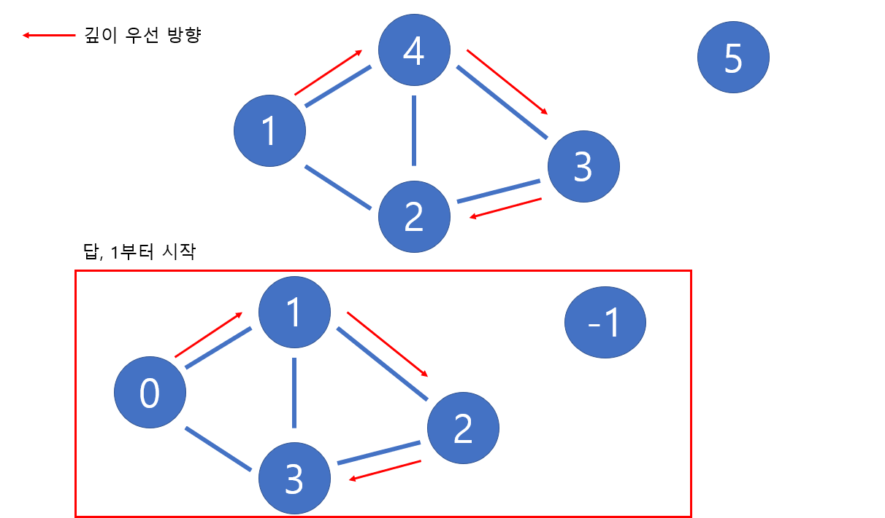

# 🧑‍💻 [Python] 백준 24482 알고리즘 수업

### Silver 2 - DFS





#### DFS 문제이다

#### 깊이 우선 탐색으로, 탐색을 할 때마다 1씩 더해주면 된다

- 연결이 아예 안 되어 있을 때에는 -1 이다
- 내림차순


#### 문제풀이

- DFS 코드를 짜면 된다


## 코드

```python
import sys

sys.setrecursionlimit(10 ** 6)
input = sys.stdin.readline

def dfs(start, count):
    visited[start] = count
        
    for cur in graph[start]:
        if visited[cur] == -1:
            dfs(cur, count + 1)
                

N, M, start = map(int, input().split())

visited = [-1] * (N + 1)

graph = [[] for _ in range(N + 1)]
for _ in range(M):
    a, b = map(int, input().split())
    graph[a].append(b)
    graph[b].append(a)

for node in graph:
    node.sort(reverse=True)

stack = []

dfs(start, 0)

for i in range(1, len(visited)):
    print(visited[i])
```


