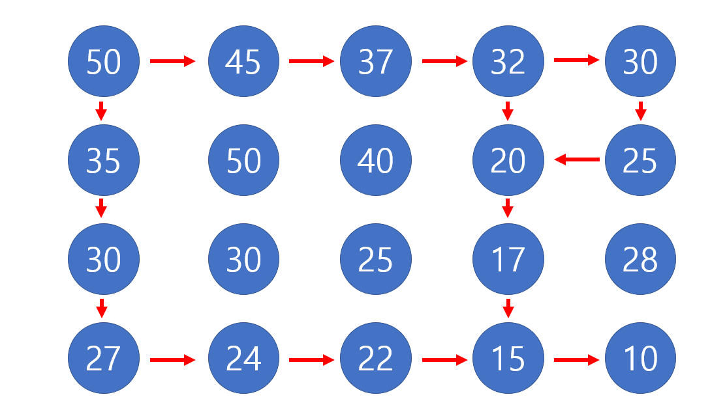

# 🧑‍💻 [Python] 백준 1520 내리막길

### Gold 3 - DFS





#### DFS는 확실히 알았으나, 이걸 어떻게 DP로 풀어야 할지 몰랐다

#### 1) 50 ▶️ 35 ▶️ 30 ▶️ 27 ▶️ 24 ▶️ 22 ▶️ 15 ▶️ 10 

#### 2) 50 ▶️ 45 ▶️ 37 ▶️ 32 ▶️ 20 ▶️ 17 ▶️ 15 ▶️ 10

#### 3) 50 ▶️ 45 ▶️ 37 ▶️ 30 ▶️ 25 ▶️ 20  ▶️ 17 ▶️ 15 ▶️ 10

- 위를 보면, **15 ▶️ 10 ** 은 3 경로 모두 겹친다
- 그리고, **20 ▶️ 17 ▶️ 15 ▶️ 10**은 2번과 3번이 겹친다
- 겹치는 부분은 한번만 탐색을 하면 된다
  - 즉 이미 방문을 했다면, **10**까지의 경로는 겹치는 것이다
  - 즉 겹치는 경로를 굳이 한번 더 탐색할 필요가 없다


## 코드

``` python
import sys
sys.setrecursionlimit(10 ** 9)

def move(row, column):

    # Base code: 재귀를 빠져 나오는 것
    if row == N - 1 and column == M - 1:
        return 1

    # 방문을 하지 않았으면, 계속 탐색하는 것
    if visited[row][column] == -1:
        visited[row][column] = 0

        for i in range(4):
            sr, sc = dr[i] + row, dc[i] + column

            if 0 <= sr < N and 0 <= sc < M:
                if matrix[row][column] > matrix[sr][sc]:

                    # 만약 끝까지 갔다면, move(sr,sc)는 1을 출력
                    visited[row][column] += move(sr, sc)

    # 방문을 한 곳이면, 해당 좌표의 숫자를 출력한다
    # 숫자는 몇 개의 경로를 탐색했는지 알려준다
    # 결국에는 콜스택이 다 없어지면서, visited[0][0]을 출력해준다
    return visited[row][column]

N, M = map(int, input().split())

matrix = [list(map(int, input().split())) for _ in range(N)]
visited = [[-1] * M for _ in range(N)]

dr, dc = [-1, 0, 0, 1], [0, -1, 1, 0]

print(move(0,0))
```


#### 마지막 visited의 결과

[[3, 2, 2, 2, 1], 

[1, -1, -1, 1, 1], 

[1, -1, -1, 1, -1], 

[1, 1, 1, 1, -1]]


시간 초과 (겹치는 경로를 한번 더 탐색하는 것)

```python
N, M = map(int, input().split())

matrix = [list(map(int, input().split())) for _ in range(N)]

dr, dc = [-1, 0, 0, 1], [0, -1, 1, 0]

stack = [(0,0)]
count = 0

while stack:
    row, column = stack.pop()
    if row == N - 1 and column == M - 1:
        count += 1

    for i in range(4):
        sr, sc = dr[i] + row, dc[i] + column

        if 0 <= sr < N and 0 <= sc < M:
            if matrix[row][column] > matrix[sr][sc]:
                stack.append((sr,sc))

print(count)
```


