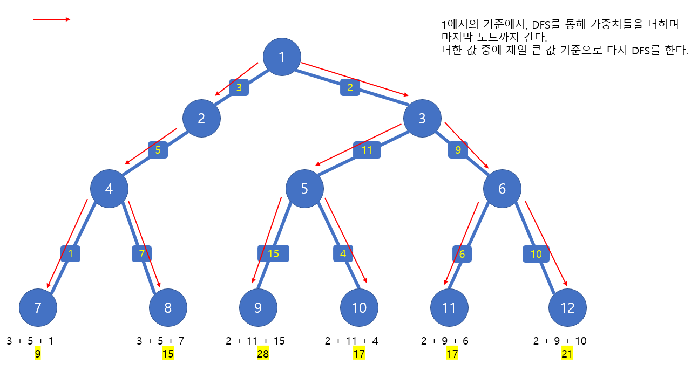
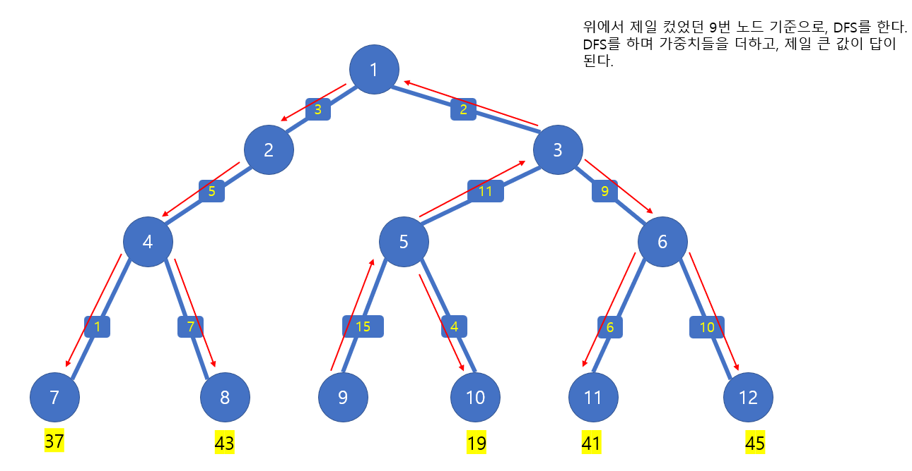

# 🧑‍💻 [Python] 백준 1967 트리의 지름

### Gold 4 - DFS







#### 두 노드 사이의 가중치들을 더했을 때에 가장 큰 숫자를 출력하는 것

#### 여기서 1의 기준에서 가중치가 제일 큰 노드를 구한다

#### 그 다음, 가중치가 제일 큰 노드를 시작으로 DFS를 하여, 제일 큰 가중치를 구한다

#### 여기서 DFS를 하면 어디서든, 제일 끝에 있는 자식 노드에 가게 된다


## 문제풀이

- 첫 DFS를 한 후에,` visited` 리스트 다시 초기화 시켜야 한다
- `second_index = visited.index(max(visited))`을 통해서 두번째 DFS를 할 때에, 시작 점을 찾는다


## 코드

``` python
import sys
sys.setrecursionlimit(10 ** 9)

def dfs(start, weight):

    for node, wei in tree[start]:
        if visited[node] == -1:
            visited[node] = weight + wei
            dfs(node, weight + wei)
            
n = int(input())
tree = [[] for _ in range(n + 1)]
visited = [-1] * (n + 1)
visited[1] = 0

for _ in range(n-1):
    a, b, w = map(int, input().split())
    tree[a].append((b, w))
    tree[b].append((a, w))

dfs(1, 0)

second_index = visited.index(max(visited))

visited = [-1] * (n + 1)
visited[second_index] = 0
dfs(second_index, 0)

print(max(visited))
```


