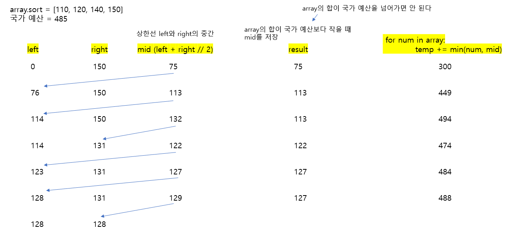

# 🧑‍💻 [Python] 백준 2512 예산

### Silver 3 - 이진 탐색


#### 예산 요청이 리스트로 주어진다.

#### 그리고 국가가 사용할 수 있는 예산이 주어진다

- 요청 된 모든 예산들이 국가가 사용할 수 있은 예산 안에 들어가야 한다

#### 그러기 위해서, 상한액을 정해서, 요청 리스트 안에 있는 예산들을 수정한다





## 코드

```python
N = int(input())
array = list(map(int, input().split()))
budget = int(input())

array.sort()

left, right = 0, array[-1]

if sum(array) <= budget:
    print(max(array))

else:
    result = 0
    while left <= right:
        mid = (left + right) // 2
        temp = 0

        for num in array:
            temp += min(num, mid)

        if temp <= budget:
            left = mid + 1
            result = mid
        else:
            right = mid - 1

    print(result)
```


