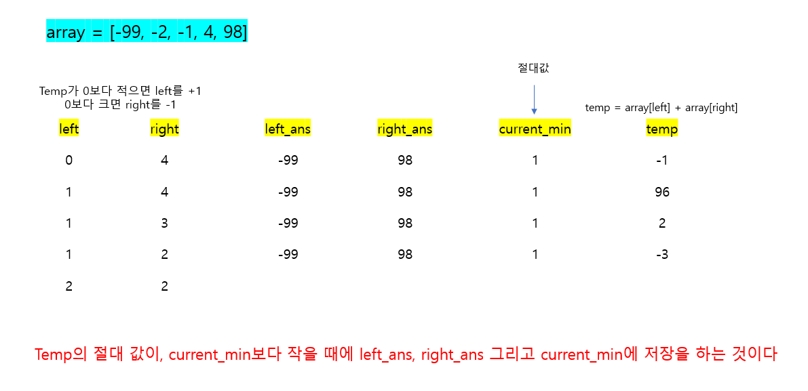

# 🧑‍💻 [Python] 백준 2512 예산

### Gold 5 - 이진 탐색


#### 산성 용액과, 알칼리성 용액이 있으면, 어떠한 두 용액을 섞어서 0과 제일 가까운 용액을 만드는 것이다

- 여기서 산성은 산성끼리, 알칼리성은 알칼리성 용액끼리 섞을 수 있다

#### 이진 탐색을 하기 위해서는 정렬을 꼭 해야 한다

#### 두 용액을 섞어서, 전에 섞은 용액보다 0과 가깝다면, 두 용액과, 용액들을 섞어서 나온 숫자를 저장해야 한다

- 즉 3개의 변수를 지속적으로 수정해야 하는 것이다




## 코드

```python
N = int(input())
array = list(map(int, input().split()))

array.sort()

left = 0
right = N - 1

current_min = abs(array[left] + array[right])
left_ans, right_ans = array[left], array[right]
min_num = []

while left < right:
    temp = array[left] + array[right]

    if abs(temp) < current_min:
        current_min = abs(temp)
        left_ans, right_ans = array[left], array[right]

        if temp == 0:
            break
    
    if temp > 0:
        right -= 1
    
    else:
        left += 1

print(left_ans, right_ans)
```


