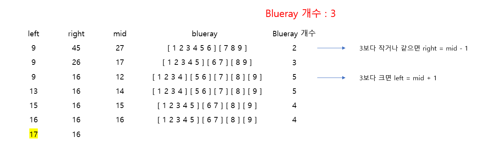

# 🧑‍💻 [Python] 백준 2343

### Silver 1 - 이진 탐색


#### 블루레이의 개수를 구하고, 개수가 작거나 같으면 right = mid - 1

#### 크면 left = mid + 1을 해준다

- 이유는, 블루레이는 강의들의 묶음으로 이루어져 있다
- 블루레이의 개수가 맞춰야 하는 개수보다 적다는 말은, 하나의 블루레이에 너무 많은 강의를 넣었다는 것이다
  - 즉 강의를 더 분포를 시켜야 한다
  - 즉 하나의 블루레이에 들어갈 수 있는 강의의 시간은 더 줄어든다는 것
- 반대로 블루레이의 개수가 맞춰야 하는 개수보다 크다는 것은, 하나의 블루레이에 너무 적은 강의를 넣었다는 것




## 코드

```python
N, M = map(int, input().split())

def count_cd(time):

    count = 0
    temp = 0

    for lecture in lectures:
        if temp + lecture <= time:
            temp += lecture
        else:
            count += 1
            temp = lecture
    
    return count + 1

lectures = list(map(int, input().split()))

left = max(lectures)
right = sum(lectures)


while left <= right:
    
    mid = (left + right) // 2

    blueray = count_cd(mid)

    if blueray <= M:
        right = mid - 1
    else:
        left = mid + 1

print(left)
```


