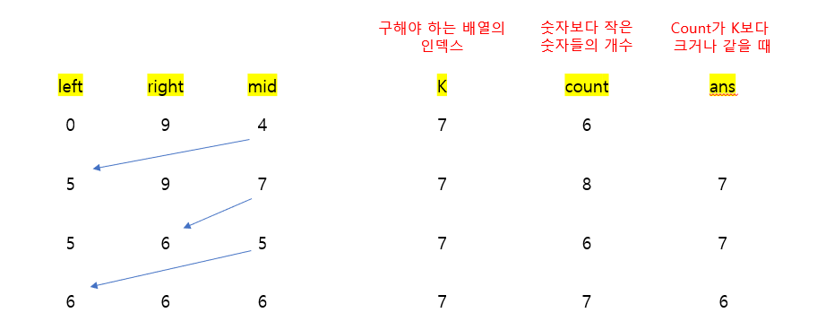

# 🧑‍💻 [Python] 백준 1300 K번째 수

### Gold 2 - 이진 탐색


#### 이 문제를 통해 더 많은 고민을 하고, 문제를 풀어야겠다는 생각을 했다

#### 그냥 이진 배열을 만들고, 그 배열을 다시 일차원으로 만들어서, 정렬을 한 후에, `k`번째 숫자를 구할 수 있다

- 하지만 테스트를 통과하지 않는다
- 이진 배열을 만들고, 또 일차원 배열로 만드는 것이 메모리 면에서, 굉장히 많이 잡아 먹는다


#### 하지만 `A[i][j]`는 패턴이 있다

- 첫 열은, 모든 수를 1로 곱하면 된다
  - [1, 2, 3, 4, 5]
- 두 번째 열은, 모든 수를 2로 곱하면 된다
  - [2, 4, 6, 8, 10]
- 세 번째 열은 ,모든 수를 3으로 곱하면 된다
  - [3, 6, 9, 12, 15]
- 이런 식인 패턴이 있다


#### 위의 패턴을 보게 된다면 특정 숫자를 만들 때에, 그 숫자보다 적은 숫자가 몇 개가 있는지 알 수 있다

- 5 X 5 인 배열
  - [1, 2, 3, 4, 5]
  - [2, 4, 6, 8, 10]
  - [3, 6, 9, 12, 15]
  - [4, 8, 12, 16, 20]
  - [5, 10, 15, 20, 25]


- 여기서 11 보다 작은 숫자들은 1, 2, 2, 3, 3, 4, 4, 4, 5, 5, 6, 6, 8, 8, 9, 10, 10 이다
  - min(11 // 1, 5) = 5    			
    - **[1, 2, 3, 4, 5]** 에서 `11`보다 작은 수, 5개
  - min(11 // 2, 5) = 5
    - **[2, 4, 6, 8, 10]** 에서 `11`보다 작은 수, 5개
  - min(11 // 3, 5) = 3
    - **[3, 6, 9, 12, 15]** 에서 `11`보다 작은 수, 3개
  - min(11 // 4, 5) = 2
    - **[4, 8, 12, 16, 20]** 에서 `11`보다 작은 수, 2개
  - min(11 // 5, 5) = 2
    - **[5, 10, 15, 20, 25]** 에서 `11`보다 작은 수, 2개


#### 즉 위와 같이, 특정 숫자보다 적은 숫자의 개수를 알 수 있다는 것은, 특정 숫자의 인덱스를 찾을 수 있다는 것이다

- 즉 숫자보다 작은 숫자의 개수가 `K`와 일치한다면, 그 숫자가 정답이 되는 것이다




## 코드

```python
N = int(input())
K = int(input())

left, right = 0, N *N

while left <= right:

    mid = (left + right) // 2
    count = 0

    for num in range(1, N + 1):
        count += min(N, mid // num)

    if count >= K:
        ans = mid
        right = mid - 1

    else:
        left = mid + 1

print(ans)
```


