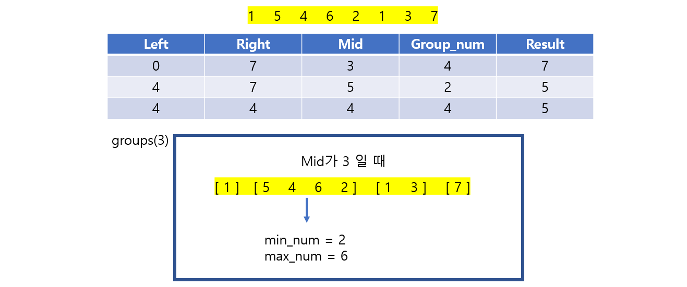

# 🧑‍💻 [Python] 백준 13397 구간 나누기 2

### Gold 4 - 이진 탐색





#### 구간의 점수의 최댓값의 최솟값을 기준으로 mid를 구하는 것이다


#### 즉 주어진 배열에서 순회하면서 구간의 최댓값과 최솟값을 구해서 mid보다 작거나 같으면 계속 탐색을 한다


#### 그게 아니면 새로운 구간을 만들어서, 새로운 최댓값과 최솟값을 구해준다


## 코드

```python
N, M = map(int, input().split())
array = list(map(int, input().split()))

def groups(mid):
    
    min_num, max_num = array[0], array[0]
    count = 1

    for i in range(N):
        min_num = min(min_num, array[i])
        max_num = max(max_num, array[i])

        if max_num - min_num > mid:
            count += 1
            min_num, max_num = array[i], array[i]

    return count


left, right = 0, max(array)
result = max(array)

while left <= right:
    mid = (left + right) // 2
    
    group_num = groups(mid)

    if group_num <= M:
        right = mid - 1
        result = min(result, mid)

    else:
        left = mid + 1

print(result)
```


