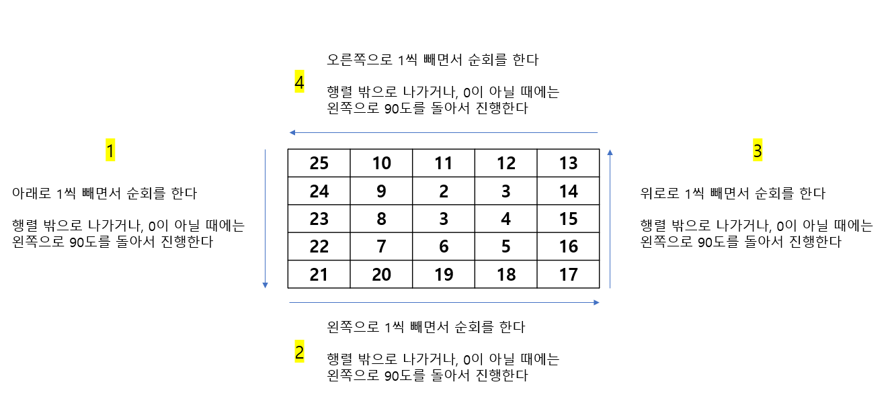

# 🧑‍💻 [Python] 백준 1913 달팽이

### Silver 3 - 구현


#### 무조건 `matrix[0][0]`은 N * N 이다


#### 시작을 N * N으로 하고, 내려가면서 -1 을 한다


#### 만약에 다음 좌표가 0이 아니거나, 행렬을 나가게 된다면 왼쪽으로 90도를 돌아서 앞으로 가면서 -1을 하면 된다


#### 이것을 좌표의 값이 1이 될때까지 진행을 한다

#### 




## 코드

```python
N = int(input())
M = int(input())

matrix = [[0] * N for _ in range(N)]

dr = [1, 0 , -1, 0]
dc = [0, 1, 0, -1]

num, i, j = N * N, 0, 0
ans_row, ans_column = 0, 0

while num > 0:

    while i < N and matrix[i][j] == 0:
        if num == M:
            ans_row, ans_column = i + 1, j + 1
        matrix[i][j] = num
        num, i = num - 1, i + 1

        
    i, j = i - 1, j + 1

    while j < N and matrix[i][j] == 0:
        if num == M:
            ans_row, ans_column = i + 1, j + 1
        matrix[i][j] = num
        num, j = num - 1, j + 1

    
    i, j = i - 1 , j - 1

    while i >= 0 and matrix[i][j] == 0:
        if num == M:
            ans_row, ans_column = i + 1, j + 1
        matrix[i][j] = num
        num, i = num - 1, i - 1

    
    i, j = i + 1, j - 1

    while j >= 0 and matrix[i][j] == 0:
        if num == M:
            ans_row, ans_column = i + 1, j + 1
        matrix[i][j] = num
        num, j = num - 1, j - 1


    i, j = i + 1, j + 1

for m in matrix:
    print(' '.join(map(str, m)))
print(ans_row, ans_column)
```


