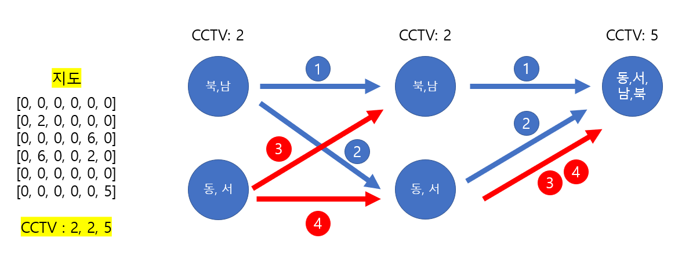

# 🧑‍💻 [Python] 백준 15683 감시

### Gold 4 - 구현


#### DFS를 하는 것인데, CCTV를 DFS 하는 것이다




#### CCTV 가 3개가 있으면 3개의 감시하는 방향을 DFS로 탐색을 한다

#### 탐색한 방향에다가 '#'을 넣는다

#### 0의 개수를 센다음, 제일 작은 수를 찾는 것


#### 지도가 주어진다고, DFS를 지도에 할 생각부터 하지 말자 ㅜ.ㅜ


## 코드

```python
from copy import deepcopy

N, M = map(int, input().split())

dr,dc  = [-1, 0, 1, 0], [0, 1, 0, -1]

direction = [[], [[0], [1], [2], [3]], [(0, 2), (1, 3)], [(0, 1), (1, 2), (2, 3), (3, 0)], [(0, 1, 2), (1, 2, 3), (2, 3, 0), (3, 0, 1)], [(0, 1, 2, 3)]]
office = []
CCTV = []

def search(k, i, j, temp_office):

    for dir in k:
        temp_i, temp_j = i, j

        while True:
            sr, sc = dr[dir] + temp_i, dc[dir] + temp_j
            if 0 <= sr < N and 0 <= sc < M:
                if temp_office[sr][sc] != 6:
                    if temp_office[sr][sc] == 0:
                        temp_office[sr][sc] = '#'
                    temp_i, temp_j = sr, sc 
                else:
                    break
            else:
                break


def dfs(mode, office):

    global result

    temp_office = deepcopy(office)

    if len(CCTV) == mode:

        count = 0
        for i in range(N):
            for j in range(M):
                if temp_office[i][j] == 0:
                    count += 1
        
        result = min(count, result)

        return
    
    CCTV_mode, i, j = CCTV[mode]

    for k in direction[CCTV_mode]:
        # i, j: CCTV 위치
        # k : CCTV 감시 방향
        search(k, i, j, temp_office)
        dfs(mode + 1, temp_office)
        temp_office = deepcopy(office)

for i in range(N):
    office.append(list(map(int, input().split())))
    for j in range(M):
        if 0 < office[i][j] < 6:
            CCTV.append((office[i][j], i, j))

result = 1e9
dfs(0, office)

print(result)
```


