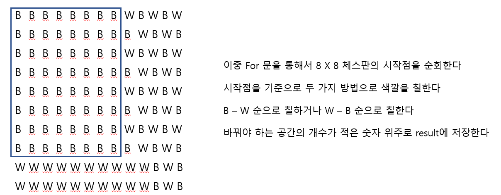

# 🧑‍💻 [Python] 백준 1018 체스판 다시 칠하기

### Silver 4 - 완전 탐색





## 코드

```python
N, M = map(int, input().split())

board = [list(input()) for _ in range(N)]

def chess(i, j):

    global result

    change_1,change_2 = 0, 0

    for row in range(8):
        for column in range(8):
            if (row + column) % 2 == 0 and board[i + row][j + column] == "B":
                change_1 += 1
            elif (row + column) % 2 == 1 and board[i + row][j + column] == "W":
                change_1 += 1

            if (row + column) % 2 == 0 and board[i + row][j + column] == "W":
                change_2 += 1
            elif (row + column) % 2 == 1 and board[i + row][j + column] == "B":
                change_2 += 1

    return min(result, change_1, change_2)

result = 1e9

for i in range(N - 7):
    for j in range(M - 7):
        result = min(result, chess(i,j))

print(result)
```


