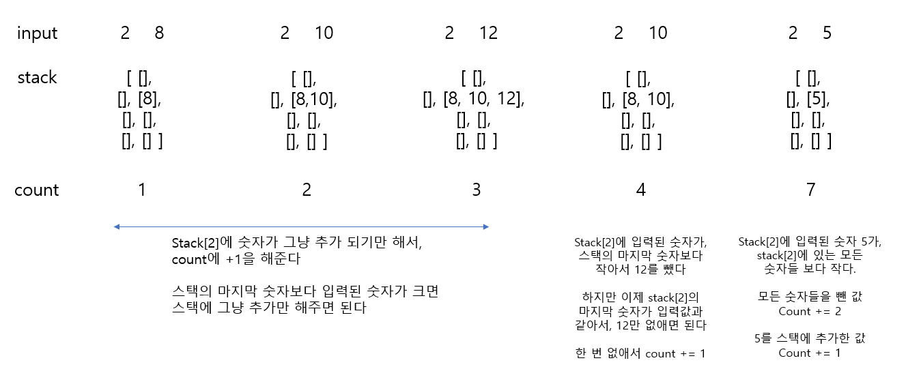

# 🧑‍💻 [Python] 백준 2841 외계인의 기타 연주

### Silver 1 - 스택





## 코드

```python
N, M = map(int, input().split())

stack = [[] for _ in range(7)]

count = 0
for _ in range(N):
    l, p = map(int, input().split())

    while stack[l] and stack[l][-1] > p:
        stack[l].pop()
        count += 1

    if not stack[l] or stack[l][-1] < p:
        stack[l].append(p)
        count += 1

print(count)

```


