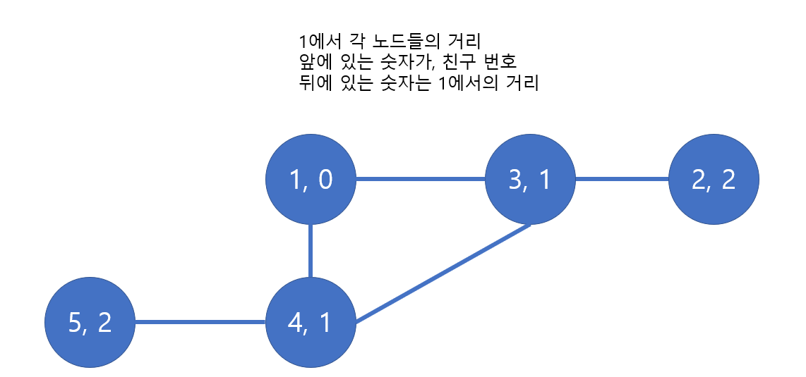

# 🧑‍💻 [Python] 백준 1389 케빈 베이컨의 6단계 법칙

### Silver 1 


#### BFS 를 사용하면서 풀었다




#### 각 숫자, 즉 1부터 N까지의 숫자와 친구의 거리를 모두 구해야 한다

- for i in range(1, N + 1) 과 for j in range(1, N + 1)인 2중 for문을 통해서 각 친구들 간의 거리를 구한다


## 코드

```python
from collections import deque

def bfs(start, end, link_num):
    queue = deque()
    queue.append((start, 0))

    visited = [0] * link_num
    visited[start] = 1

    while queue:
        current, score = queue.popleft()

        if current == end:
            return score

        for i in relations[current]:
            if visited[i] != 1:
                visited[i] = 1
                queue.append((i, score + 1))


N, M = map(int, input().split())

relations = [[] for _ in range(N + 1)]

for _ in range(M):
    A, B = map(int, input().split())
    relations[A].append(B)
    relations[B].append(A)

answer = []

for i in range(1, N + 1):
    result = 0

    for j in range(1, N + 1):
        if i != j:
            result += bfs(i, j, N + 1)

    answer.append(result)

ans, final = 1e9, -1

for i in range(len(answer)):
    if answer[i] < ans:
        final, ans = i + 1, answer[i]

print(final)
```


