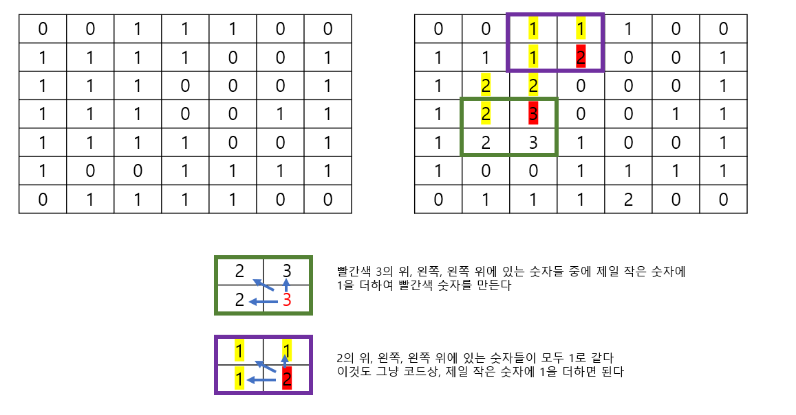

# 🧑‍💻 [Python] 백준 1915 가장 큰 정사각형

### Gold 4 - DP




#### 인덱스가 벗어나지 않는 선에서, 위, 왼쪽, 외쪽 위의 숫자들 중 min 값을 구한 다음에 1을 더해준다


## 코드

```python
N, M = map(int, input().split())
matrix = [list(map(int, input())) for _ in range(N)]
dp_table = [[0] * M for _ in range(N)]

for i in range(N):
    for j in range(M):

        if matrix[i][j] == 1:
            dp_table[i][j] = 1

            if 0 <= i - 1 and 0 <= j - 1:
                dp_table[i][j] = min(dp_table[i - 1][j], dp_table[i - 1][j - 1], dp_table[i][j - 1]) + 1

result = 0        
for d in dp_table:
    result = max(result, max(d))

print(result ** 2)
```


#### 시간 초과가 났던 코드

- 완전탐색을 기반으로 풀이를 했다. 그리고 사실상 for문을 4번을 해야 한다...

```python
N, M = map(int, input().split())

def square(i, j, length):
    
    for r in range(i, length + i):
        for c in range(j, length + j):
            if matrix[r][c] == 0:
                return False
            
    return True

matrix = [list(map(int, input())) for _ in range(N)]


l = N
flag = False


while flag == False:

    for i in range(N):
        if flag == True:
            break

        for j in range(M):

            if i + l <= N and j + l <= M:
                flag = square(i, j, l)

                if flag == True:
                    break

            else:
                break
    
    l -= 1


print((l + 1) ** 2)
```


