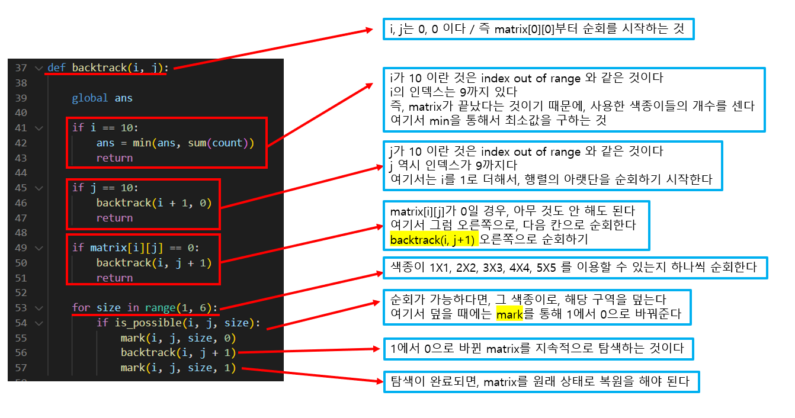
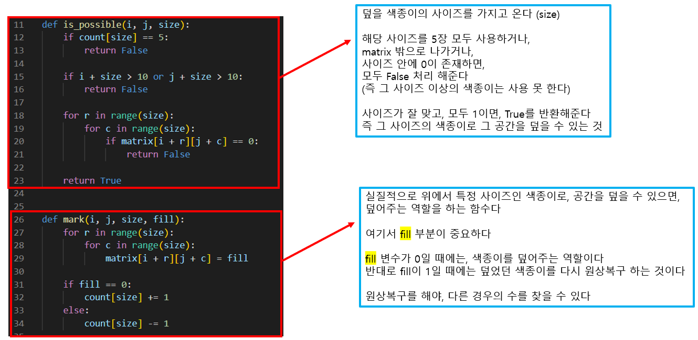

# 🧑‍💻 [Python] 백준 1915 가장 큰 정사각형

### Gold 2 - Backtracking


#### 행렬을 순회하면서, 1을 찾게되면, 그 1에 대한 모든 경우의 수를 가지고 최소값을 구하는 것이다

- 예) 찾은 1을 기준으로 1X1 색종이를 덮을 경우
- 예) 찾은 1을 기준으로 2X2 색종이를 덮을 경우
- 예) 찾은 1을 기준으로 3X3 색종이를 덮을 경우
- 예) 찾은 1을 기준으로 4X4 색종이를 덮을 경우
- 예) 찾은 1을 기준으로 5X5 색종이를 덮을 경우




#### 56번째 줄이 끝나면, 대부분의 1은 0으로 바껴져 있을 것이다 (만약 한 사이즈의 색종이를 5장을 넘기면, 1로 유지가 될 것이다)





## 코드

```python
matrix = [list(map(int, input().split())) for _ in range(10)]

count = [0] * 6

ans = 25

def is_possible(i, j, size):
    if count[size] == 5:
        return False

    if i + size > 10 or j + size > 10:
        return False

    for r in range(size):
        for c in range(size):
            if matrix[i + r][j + c] == 0:
                return False

    return True


def mark(i, j, size, fill):
    for r in range(size):
        for c in range(size):
            matrix[i + r][j + c] = fill

    if fill == 0:
        count[size] += 1
    else:
        count[size] -= 1


def backtrack(i, j):

    global ans

    if i == 10:
        ans = min(ans, sum(count))
        return

    if j == 10:
        backtrack(i + 1, 0)
        return

    if matrix[i][j] == 0:
        backtrack(i, j + 1)
        return

    for size in range(1, 6):
        if is_possible(i, j, size):
            mark(i, j, size, 0)
            backtrack(i, j + 1)
            mark(i, j, size, 1)


backtrack(0, 0)
print(-1 if ans == 25 else ans)
```


