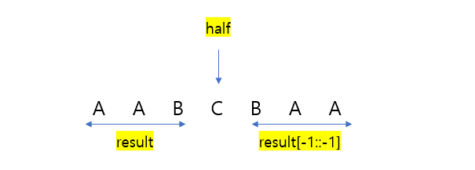

# 🧑‍💻 [Python] 백준 1213 팰린드롬 만들기

### Silver 3 - Dictionary


#### 딕셔너리에, 각 알파벳과 알파벳의 개수를 넣는다

- key는 알파벳 | value에는 알파벳의 개수


#### 알파벳 개수 중 홀수가 2개 이상이면, 팰린드롬을 만들 수 없다

- **if sum([al % 2 for al in al_dict.values()]) > 1:**
  - 홀수 이면 **al % 2** 를 할 때 1이 나온다
  - 반대로 짝수면 0이다


#### 즉 팰린드롬이 되려면, 모든 알파벳의 개수가 짝수거나, 개수 하나가 홀 수 일 때에 팰린드롬을 만들 수 있다





## 코드

```python
flag = True
al_dict = {}
alp = input()

for a in alp:
    if a in al_dict:
        al_dict[a] += 1
    else:
        al_dict[a] = 1

if sum([al % 2 for al in al_dict.values()]) > 1:
    flag = False
else:
    answer, result, half = '', '', ''

    for key, value in sorted(al_dict.items()):
        result += key * (value // 2)

        if value % 2 == 1:
            half += key

    answer = result + half + result[-1::-1]
    

if flag == False:
    print("I'm Sorry Hansoo")
else:
    print(answer)
```

- result 같은 경우, 팰린드롬의 앞 부분의 반
- half 는 팰린드롬의 중간 알파벳
  - 팰린드롬에서의 알파벳의 개수가 짝수일 때, half는 빈칸이다
  - 홀수 일 때에만 half 안에 알파벳이 들어간다
- **result[-1::-1]** 를 해서, 나머지 반을 결과 값에 넣어주는 것이다

