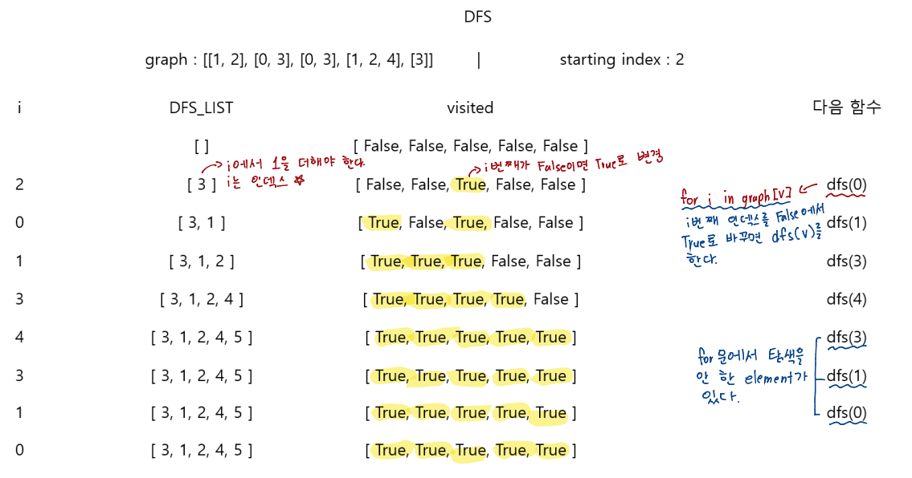
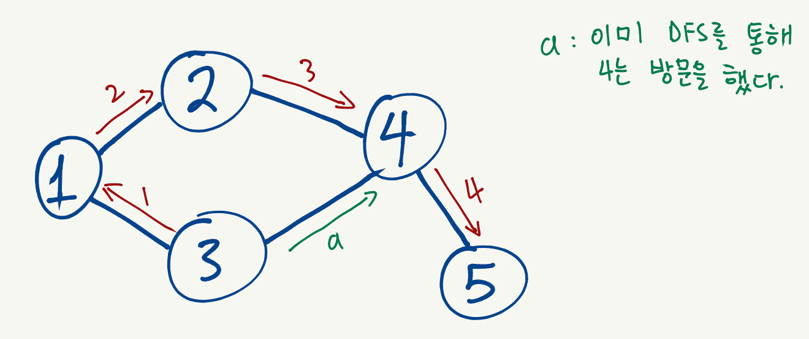
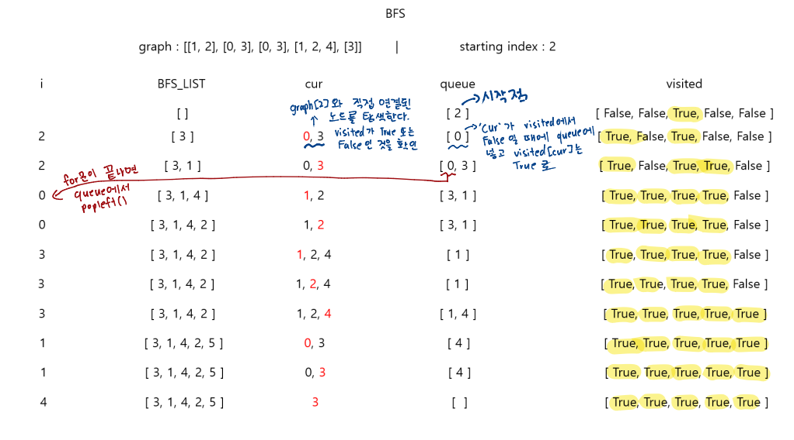
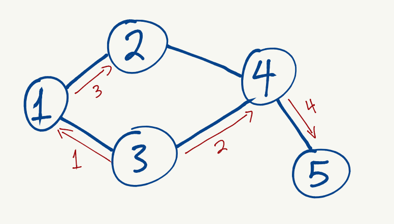

# 🧑‍💻 [Python] 백준 1260 DFS와 BFS

### Silver 2 - DFS / BFS


#### DFS는 깊이 우선이다. 먼저 한 쪽을 선택해서, 탐색을 하는 것이다

#### BFS는 넓이 우선 탐색이다. 즉 부모 노드에 여러 자식 노드가 있으면, 바로 연결되어 있는 자식 노드들 부터 탐색을 한다












#### 문제풀이

- 함수를 사용했다
- 리스트를 만들고, 리스트 안에 있는 요소들을 오름차순으로 정렬했다 (만약 길이 2개 이상이면, 숫자가 작은 곳부터 탐색을 한다)
- DFS 같은 경우, 재귀를 이용한다
  - 즉 DFS는 만약 방문을 안 한 노드가 있으면, 그 노드를 다시 `DFS(V)`를 한다
  - 방문을 했으면 for문은 끝까지 돌아갈 것이다.
    - 즉 for문이 끝났다는 것은, 이미 모든 노드를 한번씩 탐색을 했다는 것이다

- BFS 같은 경우 queue를 이용했다 (DFS는 pop을 할 수가 없다. BFS, DFS 모두 같은 데이터를 사용해야 한다)
  - `queue`를 이용하여, 주변 노드들을 탐색하는 것이다


## 코드

```python
from collections import deque

DFS_LIST = []
BFS_LIST = []

def dfs(V):
  dfs_visited[V] = 'V'
  DFS_LIST.append(V + 1)

  for i in graph[V]:
    if dfs_visited[i] != 'V':
      dfs(i)

  return DFS_LIST

def bfs(V):
  bfs_visited[V] = 'V'
  queue = deque([V])

  while queue:
    current = queue.popleft()
    BFS_LIST.append(current + 1)

    for cur in graph[current]:
      if bfs_visited[cur] != 'V':
        bfs_visited[cur] = 'V'
        queue.append(cur)

  return BFS_LIST


# N 정점의 개수 / M 간선의 개수 / V 탐색 시작
N, M, V = map(int, input().split())
V = V - 1
graph = [[] for _ in range(N)]
dfs_visited = [0] * (N)
bfs_visited = [0] * (N)

for _ in range(M):
  a, b = map(int, input().split())

  graph[a - 1].append(b - 1)
  graph[b - 1].append(a - 1)

for j in graph:
  j.sort()

print(graph)
print(' '.join(map(str, dfs(V))))
print(' '.join(map(str, bfs(V))))
```


