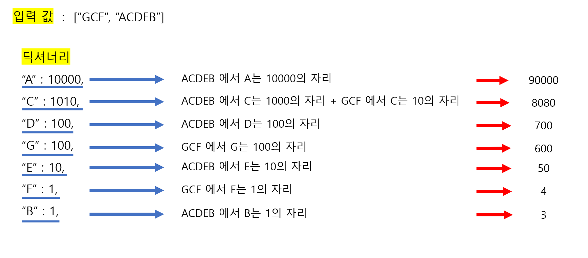

# 🧑‍💻 [Python] 백준 1339 단어 수학

### Gold 4 - 그리디


#### 문자열들이 주어진다

#### 문자열들의 알파벳에 숫자를 배정해서, 더해서 최대 수를 만드는 것이다

- A에 9를 배정했으면, 모든 문자열에 A가 들어가 있으면, 그 A들은 9이다




#### 문제풀이

> 문자열을 어떻게 딕셔너리에 넣어서, 어떻게 숫자를 배정할지 많이 고민을 했다
>
> 알파벳들이 십의 몇번째 자리인지 찾고, 그 자리에 따라서 내림차순으로 9부터 배정하는 것이다

- 각 단어들의 알파벳들을 딕셔너리에 넣는다
  - 여기서 `10 ** (times - 1)`을 하여서, 해당 알파벳이 몇 번째 자리인지 value로 넣는다
- 그리고 다 구했으면 딕셔너리의 값들을 리스트로 변환해서, 내림차순으로 정렬을 한다
- 정렬한 리스트를 순회하면서 9부터 내려가면서 곱해주고, `result`에 더하면서 누적시켜준다


## 코드

```python
N = int(input())

alphabets = [input() for _ in range(N)]

alpha_dict = {}

for alphabet in alphabets:
    times = len(alphabet)
    for num in range(times):
        if alphabet[num] not in alpha_dict:
            alpha_dict[alphabet[num]] = 10 ** (times - 1)
            times -= 1
        else:
            alpha_dict[alphabet[num]] += 10 ** (times - 1)
            times -= 1

alpha = list(alpha_dict.values())
alpha.sort(key=lambda x : -x)

result = 0
cnt = 9
for al in alpha:
    result += al * cnt
    cnt -= 1

print(result)
```

