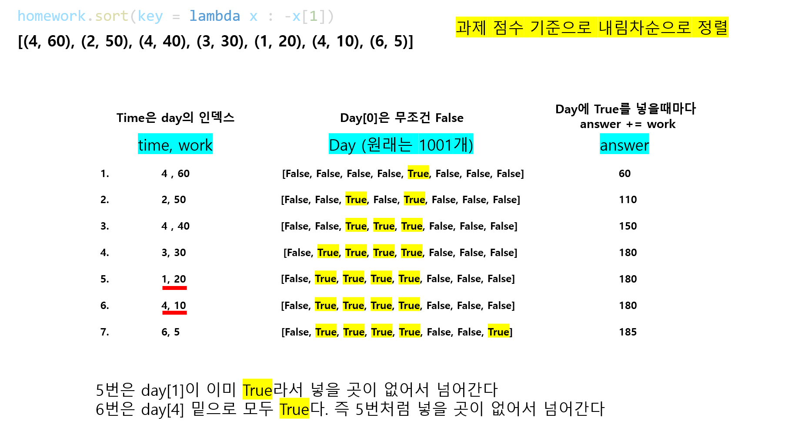

# 🧑‍💻 [Python] 백준 13904 - 과제

### Gold 5 - 정렬


#### 과제 마감일과, 과제 점수가 주어진다

#### 하루에 한 과제를 끝낼 수 있다

#### 즉 과제 점수 기준으로 내림차순으로 해서, 최대한 많은 점수를 얻으려고 한다





#### 문제풀이

- 과제 관련 정보를 입력 받는다
- 그리고 일수가 있는 리스트를 만든다
  - 이 리스트는, 어느 날에 과제를 완료했는지 확인하는 리스트다
  - 즉 False가 있고, True로 그 날 과제를 완료했다고 표시한다

- 그리고 과제들을 과제 점수가 높은 과제 기준으로 내림차순으로 정렬을 한다
- for문을 사용하여 과제들을 순회한다
  - 여기서 과제를 끝내야 하는 날이 제일 기준 index가 된다
    - 만약에 과제를 끝내야 하는 날이 False일 경우, True로 바꿔주고 `answer`에 과제 점수를 누적시켜준다

  - 과제를 끝내야 하는 날이 True일 경우, 하루 전을 탐색을 한다
    - 이 탐색을 False가 있을 때까지 반복한다 (인덱스 0은 무조건 False이어야 하니깐, 이것도 생각해 둔다)
    - 인덱스 1까지 True면 while문을 그냥 빠져나온다 (즉, 그 과제는 날려버려야 한다)


## 코드

```python
N = int(input())

homework = []

for _ in range(N):
    homework.append(tuple(map(int, input().split())))


day = [False] * 1001
homework.sort(key = lambda x : -x[1])
answer = 0

print(homework)
for time, work in homework:
    i = time

    while i > 0:
        if day[i] == False:
            day[i] = True
            answer += work
            break
        else:
            i -= 1

print(answer)
```


