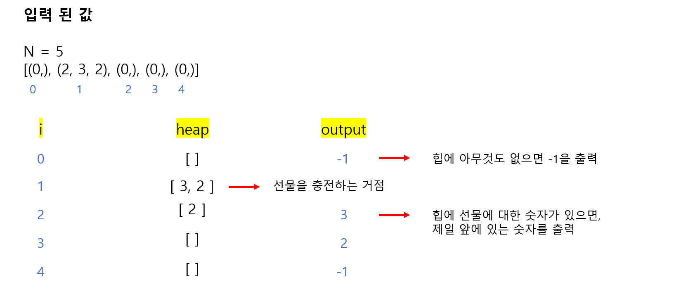

# 🧑‍💻 [Python] 백준 14235 - 크리스마스 선물

### Silver 3 - Heap


#### 입력된 값을 순회한다

#### 입력된 값이 0이 아니면 선물을 충전하는 거점

#### 0은 아이들의 집이다





#### 문제풀이

- 입력 값들을 튜플로 받아서 리스트에 넣는다
- 그리고 for문을 순회하며 0인지 아닌지 구별한다
  - 0이 아니면 선물을 충전하는 거점
    - 즉 **heap에 최대힙으로 선물에 대한 숫자를 넣는다**

  - 0이면, heap에 선물이 들어 있는지 없는지를 구별한다
    - heap에 숫자가 있으면, 제일 앞에 있는 숫자, 즉 **제일 큰 숫자**를 출력한다
    - 없으면 해당 아이에게 줄 선물이 없다는 것. 즉 **-1을 출력**한다


## 코드

```python
import heapq

N = int(input())

stops = []

for _ in range(N):
    stops.append(tuple(map(int, input().split())))

heap = []

for i in range(N):
    
    if stops[i][0] != 0:
        
        for j in range(1, stops[i][0] + 1):
            heapq.heappush(heap, -stops[i][j])

    else:
        if heap:
            print(-heapq.heappop(heap))
        else:
            print(-1)
```

