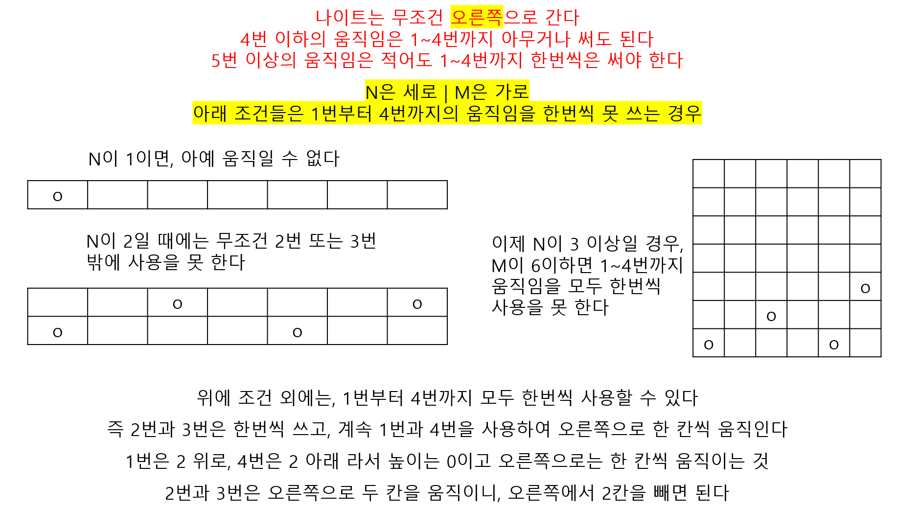

# 🧑‍💻 [Python] 백준 1783 병든 나이트

### Silver 3 - 그리디


#### 나이트는 무조건 오른쪽으로 움직이는 것을 핵심적으로 생각하면 된다

#### 즉 if문에는 1번부터 4번까지 한번씩 사용을 못 하는 경우들을 넣는다




#### 문제풀이

- 위의 내용을 if문을 통해 해결을 하면 된다


## 코드

```python
import math

N, M = map(int, input().split())

if N == 1:
    print(1)
elif N == 2:
    print(min(4, int(math.ceil(M/2))))
elif M <= 6:
    print(min(4, M))
else:
    print(M-2)
```


