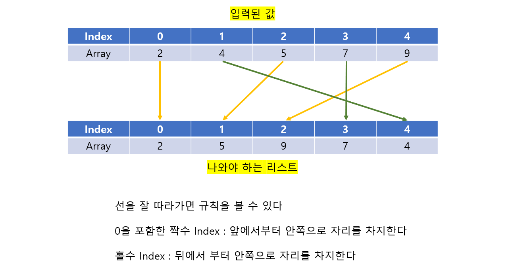

# 🧑‍💻 백준 1931 - 회의실 배정

### Silver 1 - 정렬


#### 인접한 통나무 높이의 차를 최소화 하는 문제다

#### 여기서 제일 중요한 것은 통나무를 원형으로 세워 놓는 것이라서, 제일 앞과 제일 뒤에 있는 숫자도 높이의 차에 포함을 해야 한다

- 즉 단순히 정렬을 하게 된다면, 제일 앞에 있는 숫자와 제일 뒤에 있는 숫자의 차가 제일 커서, 답을 구할 수 없다


예시)




## 문제 풀이

- 

## 코드

`timber = [0] * N` 를 만드는 이유는 정렬을 한 리스트에서, 다시 통나무들을 배치할 때, 통나무들의 높이를 넣기 위해서다.

```python
T = int(input())

for _ in range(T):
    N = int(input())

    array = list(map(int, input().split()))

    array.sort(key=lambda x: x)

    timber = [0] * N
    
    even, odd = 0, -2

    for n in range(N):
        if n % 2 == 0:
            timber[n + even] = array[n]
            even -= 1
        else:
            timber[n + odd] = array[n]
            odd -= 3

    result = abs(timber[0] - timber[-1])

    for i in range(N - 1):
        height_difference = abs(timber[i] - timber[i + 1])
        if height_difference > result:
            result = height_difference

    print(result)
```


#### 구글링......

```python
for _ in range(int(input())):
    
    N = int(input())
    array = sorted(list(map(int, input().split())))
    height = 0
    
    for i in range(2, N):
        height = max(height, abs(array[i] - array[i - 2]))
    
    print(height)
```

- #### 2칸 앞에 있는 숫자를 빼고 나서 답을 구하면 되는 문제였다...

- #### 왜? 중앙에 있는 숫자 기준으로, 앞에 있는 숫자를 빼야, 각 통나무들의 높이의 차이가 최소가 된다;;;

