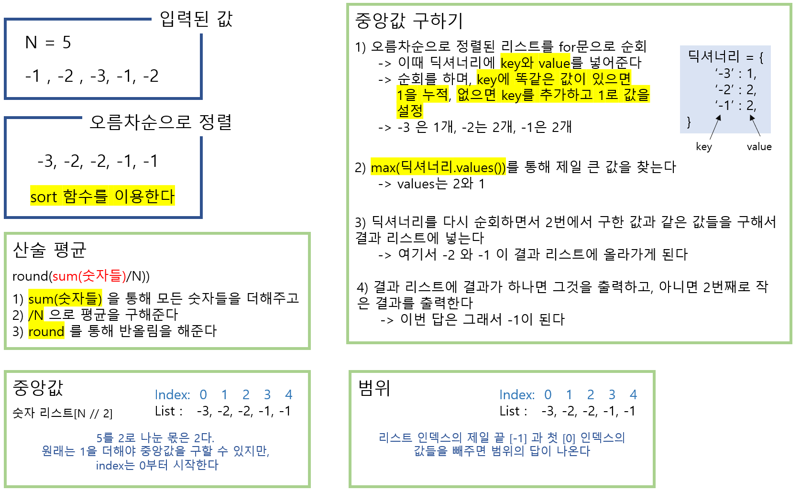

# 🧑‍💻 백준 2108 - 통계학

### Silver 3 - 정렬


### 산술과 딕셔너리를 주로 사용하면 쉽게 풀 수 있는 문제다

### 문제에서 구하라는 산술평균, 중앙값, 최빈값, 범위를 구하면 된다

- 산술평균은, 주어진 값들을 전부 더하고, 더한 값에서 주어신 숫자들의 수로 나누면 된다
- 중앙값은, 주어진 숫자들 중 중앙에 배치된 숫자를 구한다 (오름차순으로 정렬을 해야 한다)
- 최빈값은 중복 숫자가 제일 많은 숫자를 구한다. 만약에 2개 이상이 나오면, 중복 숫자가 많은 숫자들 중 2번째로 작은 숫자를 구한다
- 범위는 숫자들 중 최댓값과 최솟값의 차이를 구한다


예시)




#### 문제 풀이

> N이라는 숫자들의 개수를 준다

##### 산술평균

- 숫자들을 `sum`을 이용해서 더해주고, N으로 나눈다


##### 중앙값

- 오름차순으로 숫자들을 정렬하고, N을 2로 나눈다
- 그리고 N을 2로 나눈 몫을 인덱스로 활용해서, 오름차순으로 정렬된 리스트의 중앙 인덱스를 구해준다
  - 리스트 인덱스는 0부터 시작한다. 그래서 1을 더할 필요가 없다


##### 최빈값

- 일단 숫자들을 딕셔너리에 넣어준다
  - 딕셔너리에 넣을 때에, 숫자를 넣어주는 중복 숫자를 넣어줄 때, 값을 1씩 누적해준다
- 그리고 딕셔너리에 값들 중 제일 큰 값을 구해준다 (`max(dictionary.values())`)
  - `max`는 제일 큰 값을 구하는 것
  - `values`는 딕셔너리에 `key`가 아닌 값을 빼오는 것이다
- 그리고 딕셔너리를 다시 순회하면서, 위에 구한 제일 큰 값과 같은 `key`들을 구한다
- 그리고 if문을 통해 제일 많은 중복값이 2개 이상일때, 2번째로 작은 수를 출력한다


##### 범위

- 중앙값을 구할 때에 오름차순으로 정렬한 리스트를 사용한다
- 인덱스 -1번째 (제일 마지막 수) 와 0번째 (첫번째, 제일 작은 숫자)를 빼주면 된다


#### 코드

```python
N = int(input())

nums = []
for n in range(N):
    num = int(input())
    nums.append(num)

# 평균
print(round(sum(nums)/N)) 

nums.sort()

# 중앙값 구하기
center = N // 2
print(nums[center]) 

# 최빈값 / 다수면 두번째
diction = {}
for n in nums:
    if n not in diction:
        diction[n] = 1
    else:
        diction[n] += 1

most_value = max(diction.values())

result = []
for i in diction:
    print(i)
    if diction[i] == most_value:
        result.append(i)
        

if len(result) == 1:
    print(result[0])
else:
    print(result[1])


# 최댓값과 최솟값의 차이
print(nums[-1] - nums[0]) 
```
