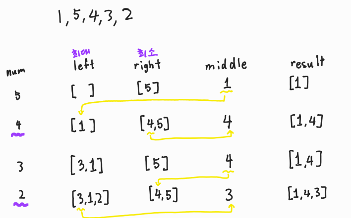
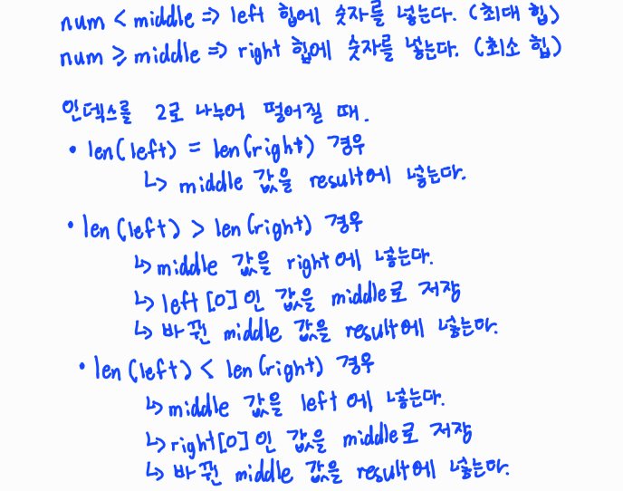

# 🧑‍💻 [Python] 백준 2696 - 중앙값 구하기

### Gold 3 - heapq


#### left와 right 힙 그리고 중간 값을 가지고 문제를 푸는 것이다

#### left는 최대 힙을 구하는 것이고, right은 최소힙을 구하는 것이다

#### middle은 제일 최근에 구한 중간 값이다

#### 즉 수열의 원소가 middle보다 작으면 left로 들어가야 하고, 크면 right로 들어가야 한다







## 코드

```python
import heapq
import math

T = int(input())

for _ in range(T):

    N = int(input())

    nums = []
    for _ in range(int(math.ceil(N / 10))):
        nums += list(map(int, input().split()))

    left, right = [], []
    middle = nums[0]
    
    result = [nums[0]]      

    for i in range(1, N):

        # 숫자가 중앙 숫자보다 작으면 left 힙 (최대 힙)에 넣는다
        if nums[i] < middle:
            heapq.heappush(left, -nums[i])
        
        # 중앙 숫자보다 크면 right 힙에 넣는다
        else:
            heapq.heappush(right, nums[i])

        if i % 2 == 0:
            if len(left) > len(right):
                heapq.heappush(right, middle)
                middle = -heapq.heappop(left)

            elif len(left) < len(right):
                heapq.heappush(left, -middle)
                middle = heapq.heappop(right)

            result.append(middle)

    print(len(result))

    if len(result) / 10 < 1:
        print(' '.join(map(str, result)))
    else:
        for i in range(int(math.ceil((len(result) / 10)))):
            temp_result = result[i * 10: (i + 1) * 10]
            print(' '.join(map(str, temp_result)))
```

