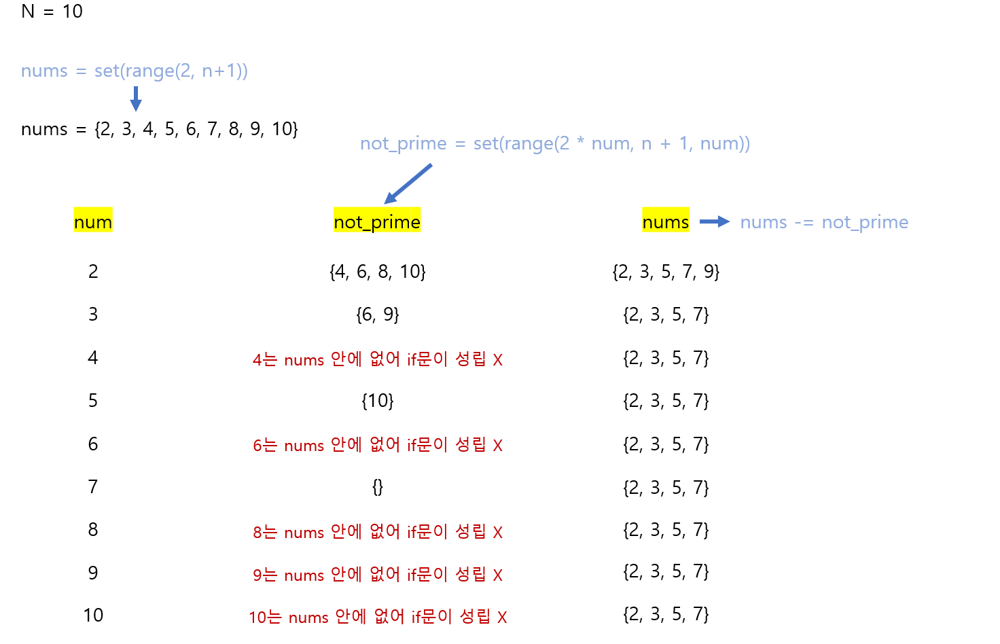

# 🧑‍💻 [Python] 프로그래머스 - 소수 구하기

### Level 2


#### 처음에는 그냥 일반적인 식으로 소수 구하기를 풀었다

- 시간 초과
- n까지의 숫자를 순회하면서, 각 숫자가 소수인지 아닌지를 찾음

#### 에라토스테네스의 체를 사용하면 더 빠르게 소수를 구할 수 있다

- 2부터 시작을 해서, 2의 배수인 숫자들, 3의 배수인 숫자들, 5의 배수인 숫자들 등을 빼주는 것이다


## 문제풀이





## 코드

```python
def solution(n):
 
    answer = 0
    flag = True
    
    if n == 1:
        answer = 0
    else:
        for num in range(2, n + 1):
            cnt = 0
            
            for i in range(1, (num // 2) + 1):
                if num % i == 0:
                    cnt += 1
                    
                    if cnt > 1:
                        flag = False
                        break
                        
            if flag == True:
                answer += 1
            else:
                flag = True
    
    return answer
```

- 마지막 3개 문제에서 시간 초과가 났다
- 내가 생각해도, 새로운 숫자를 순회할 때마다, 또 1부터 순회를 해서, 해당 숫자가 소수인지 아닌지를 구별해야 해서 시간이 많이 걸릴 것 같다


### 에라토스테네스의 체를 사용

```python
def solution(n):
    
    # 1은 소수가 아니기 때문에 2부터 n번까지 set에 넣는다
    # 그래야 나중에 겹치는 숫자들을 쉽게 뺄 수 있다
    nums = set(range(2, n + 1))
    
    for num in range(2, n + 1):
        
        if num in nums:
            not_prime = set(range(2 * num, n + 1, num))
            nums -= not_prime
            
    
    return len(nums)
```

- `not_prime = set(range(2 * num, n + 1, num))`에서 소수가 아닌 수들을 다 구한다
- `nums -= not_prime` 소수가 아닌 수들을 빼준다
