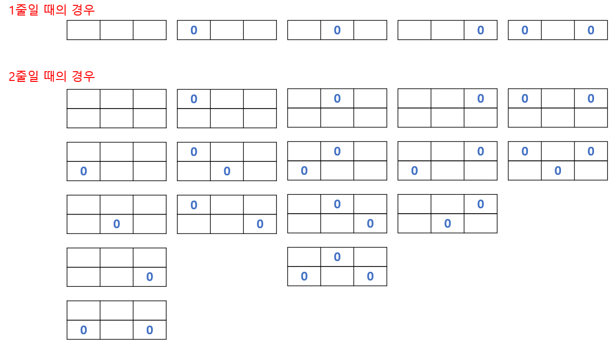

# 🧑‍💻 다이나믹 프로그래밍

*멀티잇 코딩테스트 러닝클래스'Python 5월반*


#### 미리 저장된 값을 어떻게 활용할 수 있을지 생각을 한다

- 피보나치 수 같은 경우, 1번째와 2번째를 미리 구하고, 그 앞 두 숫자를 이용하여 값을 구하는 것이다


## 피보나치 수

#### 재귀로 풀이 (Runtime Error)

```python
user_input = int(input())

def fibo(num):
	if num == 0:
		return 0
	elif num == 1:
		return 1
	
	return fibo(num - 2) + fibo(num - 1)

print(fibo(user_input) % 1000000007)
```


#### 리스트로 풀이

```python
user_input = int(input())

fibo = [1, 1]

for i in range(2, user_input):
	fibo.append((fibo[-1] + fibo[-2]) % 1000000007)
	
print(fibo[user_input - 1])
```


## 보드 게임

> #### 0번 칸부터 시작해서 N번 칸까지, 1칸씩 또는 3칸씩 앞으로 움직일 수 있을 때의 경우의 수를 구하는 


#### 피보나치와 비슷하게 생각하면 된다

- 피보나치 수는 **fibo(n-1) + fibo(n-2) = fibo(n)** 이다
- 이 문제 같은 경우 **board(n - 3) + board(n - 1) = board(n)** 을 생각해야 한다
  - 3칸 전 그리고 1칸 전

- 0번부터 2번째까지의 칸들은 무조건 경우의 수가 1 밖에 없다


```python
divi = 1000000007
user_input = int(input())
board = [0 for _ in range(user_input + 1)]

# 0번 칸부터 2번 칸까지의 경우의 수는 1 밖에 없다
board[0] = board[1] = board[2] = 1

for i in range(3, user_input + 1):
	board[i] = (board[i - 3] + board[i - 1]) % divi

print(board[user_input])
```


## 거리두기

> #### 스티커를 붙이는데, 양옆, 위 아래의 자리와 모두 공석이어야 한다





#### 위의 이미지를 보면, 위의 줄에 따라 경우의 수가 만들어진다

- 즉 바로 위의 줄의 스티커에 따라 경우의 수가 만들어진다는 점에서 위에 있는 스티커를 기준 삼아서 값을 구하면 된다


```python
N = int(input())

table = [[1, 1, 1, 1, 1] for _ in range(N)]
divi = 100000007

if N == 1:
	print(sum(table[0]))

else:
	for i in range(1, N):
		table[i][0] = (table[i-1][0] + table[i-1][1] + table[i-1][2] + table[i-1][3] + table[i-1][4]) % divi
		table[i][1] = (table[i-1][0] + table[i-1][2] + table[i-1][3]) % divi
		table[i][2] = (table[i-1][0] + table[i-1][1] + table[i-1][3] + table[i-1][4]) % divi
		table[i][3] = (table[i-1][0] + table[i-1][1] + table[i-1][2]) % divi
		table[i][4] = (table[i-1][0] + table[i-1][2]) % divi
	
	print(sum(table[N - 1]) % divi)
```

